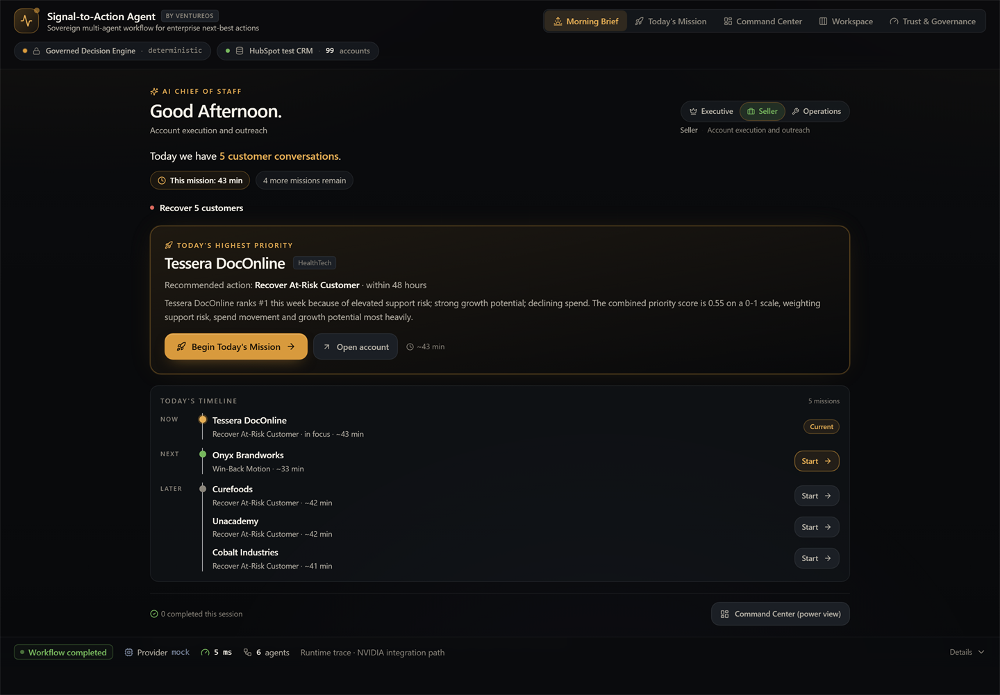
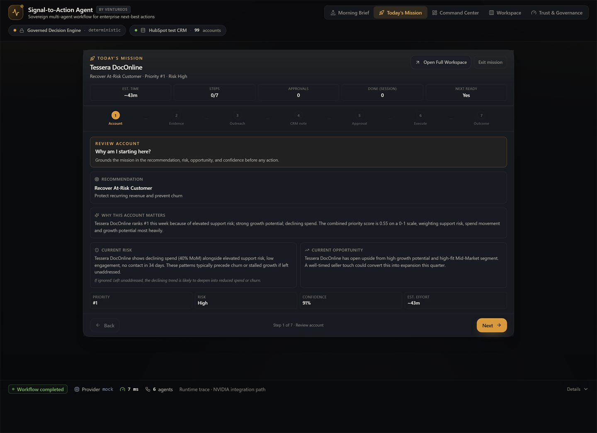
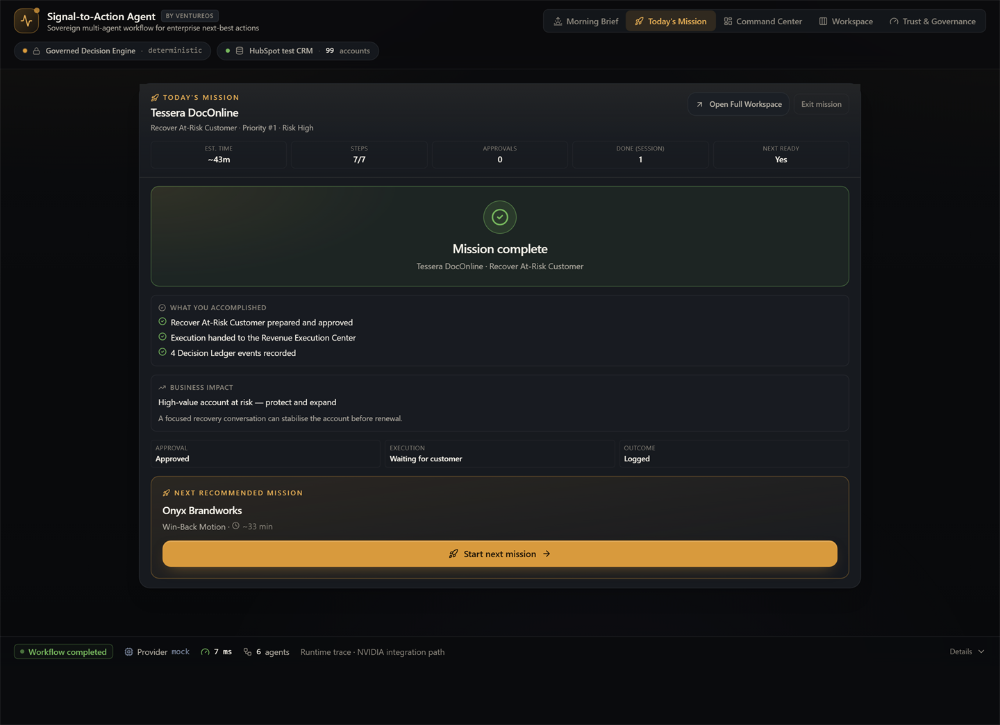

# Signal-to-Action Agent

> **A governed AI assistant for customer-facing teams.**
> It reads CRM data, market signals, and account health, identifies where
> sellers should focus this week, explains why, recommends next actions,
> and prepares CRM-ready outputs — with a human in the loop on every step
> that touches the customer record.

[](.) [](.) [](.)

> 🚀 **Live demo:** **https://ventureos-signal-to-action-agent.vercel.app**
> &nbsp;·&nbsp; **API:** https://signal-to-action-api.onrender.com
>
> _The backend runs on Render's free tier. The first request after a quiet
> period can take ~50 seconds to wake. Give it a moment and refresh._

> **🧭 Explore the project**
> &nbsp;
> 🌐 **[Product microsite](https://amit1858.github.io/ventureos-signal-to-action-agent/)**
> &nbsp;·&nbsp; 🚀 **[Live demo](https://ventureos-signal-to-action-agent.vercel.app)**
> &nbsp;·&nbsp; 📚 **[Documentation](#-documentation)**
> &nbsp;·&nbsp; 🏗 **[Architecture](docs/ARCHITECTURE.md)**
> &nbsp;·&nbsp; 📑 **[NVIDIA submission deck (PDF)](docs/submission/Signal-to-Action-Agent_NVIDIA-Deck-V4.pdf)**
>
> The **[product microsite](https://amit1858.github.io/ventureos-signal-to-action-agent/)** is the
> product front door (a GitHub Pages site). This README is the **engineering entry point** — it
> summarizes the system and links into the technical depth below.

---

## TL;DR

| | |
|---|---|
| **What** | An AI Chief of Staff for revenue teams. Answers *"Which accounts need attention this week and why?"* every Monday morning. |
| **How** | Governed multi-agent workflow with deterministic ranking, optional BYOK LLM enrichment, and a hard human approval gate before anything reaches CRM. |
| **Why it matters** | A VP signing off on outbound to 40 accounts a week needs the same answer every Monday from the same data. LLMs help explain; the governed engine decides. |
| **Trust posture** | AI helps explain and recommend. **AI does not determine priority, change governance, or execute CRM actions.** |
| **BYOK** | Users connect OpenAI, Anthropic, or NVIDIA from the browser. Keys live only in `sessionStorage`. Nothing is persisted server-side. |
| **Status** | Release 1.4B deployed — Seller Mission Control & the guided work experience · public artifacts refreshed. |

---

## The product vision

**AI Chief of Staff for customer-facing teams.**

The product continuously monitors customer health, identifies risk and
opportunity, recommends next actions, supports multi-provider reasoning,
and helps teams keep CRM up to date — *without removing human control*.

Where this is heading: the seller / CSM opens their browser on Monday,
the assistant has already triaged the book overnight, every priority
account has a recommended action with cited evidence and a draft CRM
note, and the human's job is review, refine, approve.

---

## Current production capabilities (Release 1.4B)

VentureOS now begins each persona's day differently, then guides the seller through the work. The deployed product combines these confirmed surfaces inside one governed runtime:

1. **Platform landing** — the product front door: what the system is and the governed signal → decision → outcome loop.
2. **Persona-specific Morning Brief** — one operating system, three first experiences. Executive sees *"What changed?"*, Seller sees *"What should I do first?"*, Operations sees *"What requires attention?"*
3. **Seller Morning Brief** — an AI Chief of Staff work briefing (not a dashboard): this mission's effort, an action narrative (recover / prepare / follow up), and a Now / Next / Later mission timeline.
4. **Today's Mission** — one mission, one recommendation, one clear CTA. No decision fatigue.
5. **Seller Mission Control** — a first-class guided surface that walks the seller through the seven-step flow: **Review Account → Evidence → Outreach → CRM Note → Approval → Execution → Outcome**, ending in a Mission Complete state and a next-mission handoff.
6. **Executive Command Center** — repositioned as the power view: AI Chief of Staff briefing, Executive Attention Required, Executive Daily Briefing, Executive Change Brief, and Portfolio Pulse.
7. **Workspace (Explain Mode)** — the per-account cockpit, reachable from any mission step via *Open Full Workspace*.
8. **Revenue Execution Center** — approved recommendation to measured outcome; the mission Execute step hands off into this existing flow with no duplicated execution logic.

The product journey reads:

> **Platform → Persona-specific Morning Experience → AI Chief of Staff → Guided Mission → Workspace → Command Center → Governance**

Release 1.4B is a **frontend experience layer**. Design boundary remains unchanged: **ranking, recommendation logic, scoring, governance, approval workflow, backend contracts, provider abstraction, and the Decision Ledger schema are unchanged**. See [`docs/ROADMAP.md`](docs/ROADMAP.md).

---

## Seller Mission Control — the guided work experience (Release 1.4B)

Executive mode says **"Brief me."** Seller mode says **"Guide me."** Instead of dropping a seller into a dashboard, VentureOS opens with a work briefing and walks them through one mission at a time.

**Seller Morning Brief** — an AI Chief of Staff briefing: this mission's effort, the day's action narrative, and a Now / Next / Later timeline.



**Today's Mission** — a first-class guided surface. The seller moves step by step through Review → Evidence → Outreach → CRM Note → Approval → Execution → Outcome, always knowing where they are, what to do next, and why it matters.



**Mission Complete** — a rewarding close: what was accomplished, business impact, governance/execution status, and the next recommended mission with a single CTA to continue.



Workspace remains **Explain Mode** (reachable from any step via *Open Full Workspace*); the Command Center is repositioned as the **power view**; the Revenue Execution Center still **executes**; the Decision Ledger still **audits**. Mission Control only **guides** — it adds no new engine, governance, ledger, CRM, or backend logic.

---

## How it works (in 7 steps)

```
   ┌──────────────┐     ┌────────────────────┐     ┌──────────────────────┐
   │  CRM data    │     │  External market   │     │  Governed Decision   │
   │  (HubSpot)   │ ──▶ │  signals (Serper)  │ ──▶ │  Engine — ranks &    │
   └──────────────┘     └────────────────────┘     │  scores accounts     │
                                                    └──────────┬───────────┘
                                                               │
                                                               ▼
   ┌──────────────────┐     ┌────────────────────┐     ┌──────────────────┐
   │  CRM write-back  │ ◀── │  Human approval    │ ◀── │  BYOK LLM        │
   │  (HubSpot tasks  │     │  (approve / edit / │     │  reasoning       │
   │  + notes)        │     │   reject)          │     │  (advisory only) │
   └──────────────────┘     └────────────────────┘     └──────────────────┘
```

1. **CRM data** is pulled from a HubSpot test portal (99 demo accounts).
2. **External intelligence** comes from a pluggable provider layer (`serper`
   or `searchapi`, optional, default off).
3. **Governed Decision Engine** runs a deterministic, auditable ranking
   across the portfolio — risk, opportunity, confidence, recommended
   action — using rules + evidence.
4. **BYOK LLM reasoning** (optional) enriches the top-N recommendations
   with executive summaries, conversation strategies, and CRM note drafts.
5. **Decision ledger** captures every agent invocation, evidence used,
   reasoning summary, confidence and caveats.
6. **Human approval** is required before anything leaves the system. The
   approval gate is a hard contract — not a UI nicety.
7. **CRM write-back** creates HubSpot tasks and notes only after approval.

---

## What AI does and does NOT do

| AI helps with | AI does NOT |
|---|---|
| ✓ Executive summaries | ✗ Determine ranking |
| ✓ Conversation strategies | ✗ Change prioritization |
| ✓ CRM note drafts | ✗ Bypass governance |
| ✓ Market intelligence synthesis | ✗ Approve actions |
| ✓ Risk narratives | ✗ Write to CRM automatically |
| ✓ Opportunity narratives | |

This boundary is enforced in code (the LLM never touches the
`priority_rank` / `priority_score` / `confidence` fields) **and** visible
to the user in real time via the AI Reasoning Status chip and the
*"How AI is helping"* panel in the Trust & Governance view.

---

## Bring Your Own Key (BYOK)

The product ships with a **deterministic baseline** that needs no API
keys. Users who want LLM-enriched narrative can connect their own
provider from the browser.

- Supported providers (Phase 6): **OpenAI**, **Anthropic Claude**, **NVIDIA Nemotron**.
- Keys are stored **only** in browser `sessionStorage`.
- Keys are **never** committed, **never** persisted to a database,
  **never** logged, **never** returned from any API, and **never** set in
  the Render environment.
- A session key travels in the request body of one provider call and is
  used for that single request only.
- Closing the browser tab clears the key.
- The deterministic engine remains the fallback if the LLM call fails.
- Live model discovery: when you connect a provider, we call the
  provider's own model-list endpoint so you never have to type a model
  identifier.
- A connected key powers the **advisory reasoning overlay** (the Executive
  synthesis card and the Reasoning Source strip). The deterministic ranking,
  scores, confidence, and the seller-ready drafts are unchanged — the key adds
  narration, not control. See [Architecture §14](docs/ARCHITECTURE.md) for the
  two model-integration paths.

---

## Architecture (one-line per layer)

| Layer | Tech | Where it runs |
|---|---|---|
| Frontend | Next.js 14 + TypeScript + Tailwind | Vercel |
| Backend | FastAPI + Pydantic + SQLite | Render |
| CRM connector | HubSpot REST + Private App token | Backend |
| External intelligence | Serper / SearchAPI (pluggable) | Backend |
| Reasoning | Governed Decision Engine (deterministic) + BYOK provider framework | Backend orchestrator, browser-supplied keys |
| Governance | Evaluation Center, trust controls, approval gate, decision ledger | Frontend + backend |

The repo also contains an NVIDIA NIM adapter stub for the
hackathon-eligible track and an evaluation harness measured on the
latest run.

For the full architecture deep-dive see [`docs/ARCHITECTURE.md`](docs/ARCHITECTURE.md).

---

## Deployment

| | URL | Host |
|---|---|---|
| **Frontend** | https://ventureos-signal-to-action-agent.vercel.app | Vercel |
| **Backend** | https://signal-to-action-api.onrender.com | Render |
| **Repo** | https://github.com/amit1858/ventureos-signal-to-action-agent | GitHub `main` |

### Backend environment variables (required)

```bash
HUBSPOT_ENABLED=true
HUBSPOT_ACCESS_TOKEN=pat-xxxxxxxxxxxxxxxx     # test portal only
HUBSPOT_AUTO_SYNC_ON_STARTUP=true
HUBSPOT_WRITEBACK_ENABLED=true

EXTERNAL_SIGNALS_ENABLED=true
EXTERNAL_SIGNALS_PROVIDER=serper
SERPER_API_KEY=your-serper-key

MODEL_PROVIDER=mock                            # deterministic baseline
```

### Backend environment variables — explicitly NOT required

```bash
# OPENAI_API_KEY      ← do NOT set on the server
# ANTHROPIC_API_KEY   ← do NOT set on the server
# NVIDIA_API_KEY      ← do NOT set on the server
```

These are intentionally absent. Provider credentials are **browser-supplied
session keys**, not server environment variables. Setting them server-side
would defeat the BYOK security model.

### Frontend environment variables

```bash
NEXT_PUBLIC_API_BASE_URL=https://signal-to-action-api.onrender.com
```

---

## 📖 Documentation

The repository doubles as the product's documentation portal. Start with the
[Product Overview](docs/PRODUCT_OVERVIEW.md), then dive into the area you care about.

**Product & submission**
- [Product microsite](https://amit1858.github.io/ventureos-signal-to-action-agent/) — the public product front door (GitHub Pages)
- [Live demo](https://ventureos-signal-to-action-agent.vercel.app) — the deployed application
- [NVIDIA submission deck (PDF)](docs/submission/Signal-to-Action-Agent_NVIDIA-Deck-V4.pdf) — 29-slide executive deck

**Start here**
- [Product Overview](docs/PRODUCT_OVERVIEW.md) — the business story (PMs, leaders, judges, investors)
- [Quick Start](docs/QUICK_START.md) — run it locally in minutes (developers)
- [Demo Guide](docs/DEMO_GUIDE.md) — 2 / 5 / 10 / 15-minute presenter scripts

**Architecture & technical depth**
- [Architecture](docs/ARCHITECTURE.md) — the flagship system document
- [Agent Architecture](docs/AGENT_ARCHITECTURE.md) — the six-agent multi-agent runtime
- [Governance](docs/GOVERNANCE.md) — approval gate, Decision Ledger, evidence, BYOK
- [Revenue Execution](docs/REVENUE_EXECUTION.md) — approved decision → measured outcome

**NVIDIA & voice**
- [NVIDIA Alignment](docs/NVIDIA_ALIGNMENT.md) — NIM · Nemotron · NeMo · Triton mapping
- [Voice Chief of Staff](docs/VOICE_CHIEF_OF_STAFF.md) — planned Gnani.ai voice layer
- [NVIDIA Integration Plan](docs/nvidia-integration-plan.md) — the detailed phased plan

**Operate & contribute**
- [Roadmap](docs/ROADMAP.md) — Current / Hackathon / Future
- [Deployment](docs/DEPLOYMENT.md) · [Operations](docs/OPERATIONS.md) — ship and run it
- [Security](docs/SECURITY.md) — secrets, BYOK, responsible disclosure
- [Contributing](docs/CONTRIBUTING.md) — standards, branches, PRs
- [FAQ](docs/FAQ.md) — common questions, answered

**Reference**
- [Demo Script](docs/DEMO_SCRIPT.md) · [Testing](docs/TESTING.md) · [Evaluation Plan](docs/evaluation-plan.md)
- [HubSpot Integration](docs/hubspot-integration.md) · [Dataset Schema](docs/dataset-schema.md)

---

## Local development

```powershell
# 1. Backend
cd services/api
python -m venv .venv
.\.venv\Scripts\Activate.ps1
pip install -r requirements.txt
python data/generate_synthetic_data.py   # one-time synthetic dataset
python -m uvicorn main:app --reload --port 8000

# 2. Frontend (separate terminal)
cd apps/web
npm install
npm run dev                              # http://localhost:3000
```

Set `NEXT_PUBLIC_API_BASE_URL=http://localhost:8000` in `apps/web/.env.local`
to point the frontend at your local backend.

---

## Project status

| Phase | What shipped |
|---|---|
| 1 | Agentic backend MVP + synthetic data |
| 2 | Enterprise frontend polish |
| 3 | Demo-first landing |
| 4 | HubSpot connector · external signals · Executive Decision Brief · CRM write-back |
| 5.0A–C | Decision provider framework · true BYOK UI · live model discovery · production validation |
| 5.1 | Executive demo hardening (business language, Provider Consensus, Production Readiness matrix) |
| **6** | **AI Reasoning Experience & Transparency Layer** |
| **14D–14F** | **Executive Change Brief, Portfolio Timeline, Executive Daily Briefing (narrative layer)** |
| **15A–15C.5** | **Adaptive Experience Modes + navigation/routing hardening** |
| **16A** | **Revenue Execution Center + closed-loop outcomes + Decision Ledger integration polish** |
| **1.4A** | **Product journey correction: landing = Product, Morning Brief = Experience, Command Center = Operating System** |
| **1.4B** | **Seller Mission Control: persona-first Morning Brief, Seller Morning Brief, Today's Mission, first-class guided 7-step Mission Mode, Mission Complete + next-mission handoff** |

### Roadmap snapshot

**Implemented today**
- Platform landing
- Morning Brief (persona-specific: Executive / Seller / Operations)
- Seller Morning Brief + Today's Mission
- Seller Mission Control (guided 7-step mission, Mission Complete, next-mission handoff)
- Executive Command Center (power view)
- Workspace (Explain Mode)
- Revenue Execution Center
- Decision Ledger
- Governance
- HubSpot integration

**Next / In Review (not yet confirmed in the deployed build)**
- Manager execution / adoption view
- Meeting Intelligence
- Visual reasoning enhancements
- Decision Intelligence Studio
- Trend Intelligence
- AI Chief of Staff Conversation

**Planned**
- Voice Chief of Staff with Gnani.ai (STT / SALM / TTS)
- Digital avatar

**Future vision**
- Meeting Coach
- Enterprise multimodal workspace
- Coach + Delegate stages of the AI Chief of Staff

What's next: see [`docs/ROADMAP.md`](docs/ROADMAP.md).

---

## Decision Ledger & action lifecycle

Every approval, rejection, or review request in the Account Workspace is now recorded in a
persistent Decision Ledger. Each entry captures the recommendation, the account, the reviewer,
the reviewer note, the decision type, confidence, evidence count, business impact, governance
caveat, and source (deterministic | ai_assisted | multi_agent).

Each recommendation now carries an explicit lifecycle:

  Detected -> Recommended -> Prepared -> Submitted for approval ->
    Approved | Rejected -> Executed -> Outcome captured

After approval the user can capture a real-world outcome (Meeting booked, Customer contacted,
Renewal risk reduced, Opportunity created, No response, Follow-up required). The ledger is
visible in Trust and Governance as a Manager Summary, a Decision Ledger table, and a CRM
Writeback Readiness lifecycle (Prepared -> Approved -> Ready for CRM -> Written -> Verified).

The lifecycle stops at "Ready for CRM" � CRM write-back is not enabled in demo mode. A future phase will
route approved actions through the existing HubSpot connector. The ledger API surface
(`apps/web/lib/decisionLedger.ts`) is backend-swappable; today it persists to browser
localStorage so the demo works without auth.

This section is additive. Scoring, ranking, governance, approval logic, agents, and backend
contracts are unchanged.

---

## License

This is a hackathon project by **Team VentureOS**. Demo CRM data only.
No real customer information.
