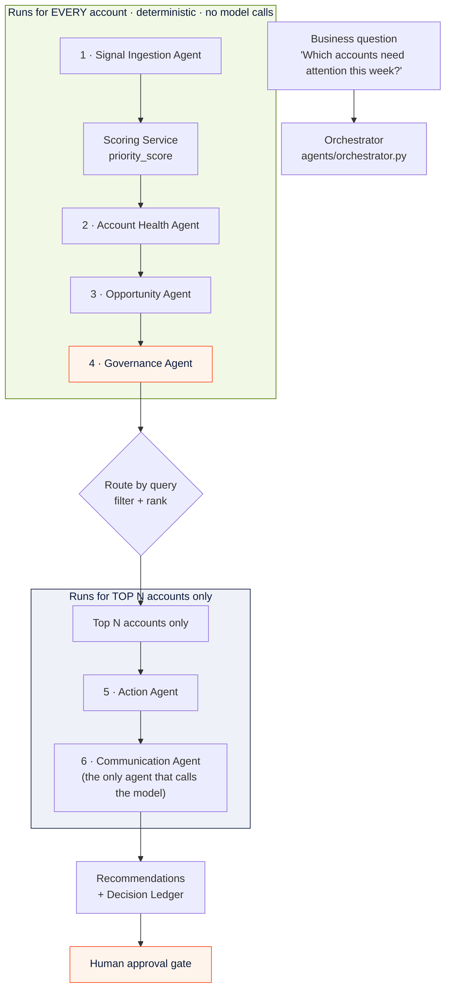
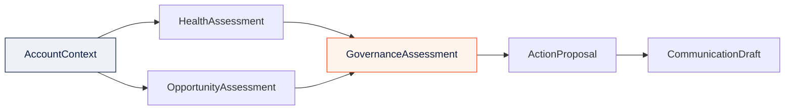
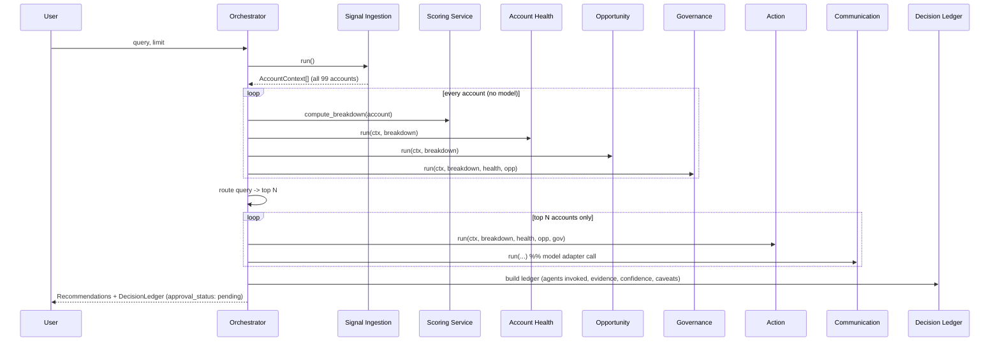

# Agent Architecture — Signal-to-Action Agent

> The multi-agent runtime in depth: every agent, its typed contract, and why
> six focused agents beat one monolithic model. For engineers, architects, and
> technical hackathon reviewers.

Signal-to-Action Agent is **not** a chatbot wrapped around an LLM. It is a
controlled, deterministic, six-agent workflow with typed input/output contracts,
an evidence trail, a confidence model, and a hard human-approval gate. The
language model **explains**; it never **decides**.

Source of truth: `services/api/agents/` (orchestrator + six agents) and
`services/api/schemas/agent_outputs.py` (the typed contracts).

---

## 1. The workflow at a glance



The execution order is **fixed and auditable** (`AGENT_SEQUENCE` in
`orchestrator.py`):

```
Signal Ingestion -> [score all] -> Account Health -> Opportunity
                 -> Governance -> (route by query) -> Action -> Communication
```

A key efficiency and governance decision: the first four agents plus
deterministic scoring run for **all 99 accounts** with **zero model calls**.
Only after the query routes the portfolio down to the top `limit` accounts do
the Action and Communication agents run — and only the Communication Agent calls
the model adapter at all. This keeps the system cheap, fast, reproducible, and
explainable.

---

## 2. Why six agents instead of one big model

| One monolithic LLM | Six typed agents (this system) |
|---|---|
| Ranking hidden inside a prompt | Ranking computed in code, inspectable and reproducible |
| "Trust me" confidence | Confidence is a formula with named inputs |
| Evidence is asserted | Evidence is attributed to a source agent and source system |
| One failure = whole answer fails | Agents fail independently; deterministic fallback always works |
| Hard to test | Each agent is a pure function with a typed contract — unit-testable |
| Governance is a suggestion | Governance is its own agent that every run must pass through |

Splitting the workflow into focused, single-responsibility agents is what makes
the product **governable**. Each agent does one thing, emits a typed Pydantic
object, and hands off to the next. The boundaries are the contracts in
`schemas/agent_outputs.py`.

---

## 3. The typed contracts

Every agent consumes and produces a Pydantic model — never a bare dict. This is
the data shape that lets the Python orchestrator be mapped onto the NVIDIA NeMo
Agent Toolkit later without losing fidelity.



| Contract | Produced by | Key fields |
|---|---|---|
| `AccountContext` | Signal Ingestion | `account`, `signals[]`, `notes[]`, `positive_signal_count`, `negative_signal_count`, `spend_delta`, `spend_delta_pct` |
| `HealthAssessment` | Account Health | `risk_score` (0–1), `risk_factors[]`, `health_summary`, `evidence[]` |
| `OpportunityAssessment` | Opportunity | `opportunity_score` (0–1), `opportunity_factors[]`, `opportunity_summary`, `evidence[]` |
| `GovernanceAssessment` | Governance | `governance_status`, `confidence_score` (0–1), `caveats[]`, `evidence_count`, `requires_human_approval` (always `True`) |
| `ActionProposal` | Action | `action_type`, `recommended_action`, `rationale`, `urgency` |
| `CommunicationDraft` | Communication | `draft_email`, `call_script`, `voice_summary` |

---

## 4. The six agents

### Agent 1 — Signal Ingestion Agent

| | |
|---|---|
| **File** | `agents/signal_ingestion_agent.py` |
| **Purpose** | The entry point. Turn raw, fragmented signals into clean typed context. |
| **Input** | None directly — loads from `services/data_loader` (accounts, signals, notes) |
| **Output** | `List[AccountContext]` — one per account |
| **Model calls** | None (deterministic) |

**Responsibilities:** load account + signal + note data; group signals by
account; count positive vs. negative signals; compute month-over-month spend
delta (absolute and percent). Produces the structured context every downstream
agent reasons over.

**Decision boundary:** does not score, rank, or judge — it only normalizes and
groups.

---

### Agent 2 — Account Health Agent

| | |
|---|---|
| **File** | `agents/account_health_agent.py` |
| **Purpose** | Detect risk and attach attributable evidence. |
| **Input** | `AccountContext`, `ScoreBreakdown` |
| **Output** | `HealthAssessment` |
| **Model calls** | None (deterministic) |

**Risk factors detected:** declining spend (≥ 10% MoM), elevated support risk
(score ≥ 50), low engagement (< 45), inactivity (no contact > 30 days), imminent
renewal (≤ 30 days). Every negative first-party signal is pulled through as
first-class `Evidence`.

**Risk score (deterministic):**

```
risk_score = 0.35 * support_risk
           + 0.30 * spend_decline
           + 0.20 * engagement_gap
           + 0.15 * renewal_urgency      (clamped to 0..1)
```

**Decision boundary:** identifies and explains risk; it does not decide the
action or the final priority.

---

### Agent 3 — Opportunity Agent

| | |
|---|---|
| **File** | `agents/opportunity_agent.py` |
| **Purpose** | Detect growth potential and attach evidence. |
| **Input** | `AccountContext`, `ScoreBreakdown` |
| **Output** | `OpportunityAssessment` |
| **Model calls** | None (deterministic) |

**Opportunity factors detected:** high growth potential (≥ 60), strong campaign
response (≥ 65), rising spend (≥ 5% MoM), healthy product usage (≥ 65),
high-fit segment (SMB / Mid-Market with growth potential ≥ 55). Every positive
first-party signal becomes `Evidence`.

**Opportunity score (deterministic):**

```
opportunity_score = 0.40 * growth_potential
                  + 0.30 * campaign_response
                  + 0.20 * product_usage
                  + 0.10 * spend_growth      (clamped to 0..1)
```

**Decision boundary:** quantifies upside; does not choose the action.

---

### Agent 4 — Governance Agent ⭐

| | |
|---|---|
| **File** | `agents/governance_agent.py` |
| **Purpose** | The agent that makes the workflow *governed*. |
| **Input** | `AccountContext`, `ScoreBreakdown`, `HealthAssessment`, `OpportunityAssessment` |
| **Output** | `GovernanceAssessment` |
| **Model calls** | None (deterministic) |

**Responsibilities:** decide whether there is enough evidence to act, compute a
confidence score, attach caveats when confidence is low, and **guarantee that no
action is ever auto-executed** — `requires_human_approval` is hardcoded `True`.

**Confidence score (deterministic):**

```
confidence = 0.15
           + 0.45 * evidence_factor   (evidence_count / 5, capped)
           + 0.25 * avg_signal_strength
           + 0.15 * signal_factor     (signal_count / 3, capped)
```

**Governance status:** `insufficient_evidence` (no evidence) → `review_required`
(confidence < 0.55) → `ok`. Caveats are added for: no first-party signals,
fewer than 2 evidence items, confidence below the 0.55 action threshold, and
mixed positive/negative signals. The human-approval caveat is **always**
appended.

**Decision boundary:** this is the gate. Low confidence does not silently
disappear — it becomes a visible caveat and a `review_required` status. No
status, ever, removes the human-approval requirement.

---

### Agent 5 — Action Agent

| | |
|---|---|
| **File** | `agents/action_agent.py` |
| **Purpose** | Convert the risk/opportunity picture into one concrete next-best action. |
| **Input** | `AccountContext`, `ScoreBreakdown`, `HealthAssessment`, `OpportunityAssessment`, `GovernanceAssessment` |
| **Output** | `ActionProposal` |
| **Model calls** | None (deterministic priority rules) |

**`action_type` is one of:** `support_escalation` · `renewal_prep` ·
`optimization_review` · `reactivation` · `follow_up` · `monitor`.

**Deterministic priority ladder** (first match wins — explainable and
reproducible):

1. **Support risk dominant** → `support_escalation` (resolve before any
   commercial motion)
2. **Renewal ≤ 30 days** → `renewal_prep`
3. **Spend decline ≥ 15%** → `optimization_review` (if opportunity ≥ 0.50) else
   `reactivation`
4. **Campaign-engaged but no follow-up** → `follow_up`
5. **Strong opportunity, low risk** → `follow_up` (expansion)
6. **Insufficient evidence** → `monitor` (route for manual review)
7. **Stable** → `monitor` (do not contact yet)
8. **Balanced default** → `follow_up` (light-touch check-in)

**Decision boundary:** chooses *what* to do, using rules — not a prompt. Note
that "do nothing yet" (`monitor`) is a first-class, recommendable action.

---

### Agent 6 — Communication Agent

| | |
|---|---|
| **File** | `agents/communication_agent.py` |
| **Purpose** | Turn the chosen action into seller-ready communications. |
| **Input** | `AccountContext`, `ActionProposal`, `HealthAssessment`, `OpportunityAssessment`, `ScoreBreakdown`, `priority_rank` |
| **Output** | `CommunicationDraft` (email, call script, voice summary) |
| **Model calls** | **Yes — this is the only agent that calls the model adapter** |

**Responsibilities:** generate a plain-language email draft, a call script, and a
short voice summary. It runs **only for the top-ranked accounts** (the "model
only explains the top accounts" principle). For `monitor` actions it
deliberately produces an **internal note**, not outreach — because those accounts
should not be contacted yet.

**Decision boundary:** this is where the language model lives. Crucially, the
model only *phrases* facts the deterministic agents already computed. It receives
a structured payload (recommended action, headline reason, headline risk/
opportunity, spend delta, rank) and writes prose. It cannot change the ranking,
the score, the confidence, or the approval status.

---

## 5. How the agents collaborate



Every run emits a `DecisionLedger` with a `LedgerAgentStep` for each agent
(status, summary, evidence count, duration), the average confidence, the caveats,
the final recommendation, and `approval_status: pending_human_approval`. That is
the auditable trace behind the on-screen Decision Ledger. See
[Governance](GOVERNANCE.md).

---

## 6. Query routing — how a question becomes a filter

The orchestrator maps the natural-language question to a deterministic filter +
sort strategy (`_route_query`). Examples:

| Question contains | Filter | Sort by |
|---|---|---|
| "declining spend" + "growth" | spend decline ≥ 10% and growth ≥ 55 | opportunity score |
| "support" + "escalate/risk" | support risk ≥ 0.50 or open ticket | support risk |
| "campaign" | campaign response ≥ 65 and no contact > 30d | campaign response |
| "renewal" | renewal ≤ 45 days | renewal urgency |
| "not be contacted" | low risk and low opportunity | risk (ascending) |
| "weak evidence" / "manual" | governance status ≠ ok or < 2 evidence | confidence (ascending) |

If no filter matches, it falls back to a pure priority ranking — **a run never
returns an empty board.** The language model is never in this routing path; the
business logic is code.

---

## 7. A complementary surface: on-demand specialist agents

Beyond the six-agent deterministic workflow, the backend also exposes an
on-demand **multi-agent specialist** surface
(`POST /api/multi-agent/{id}` and `/api/multi-agent/portfolio`) used by the
Workspace for deeper, single-account analysis — specialist roles such as Risk,
Growth, Research, Engagement, and Governance views. These complement, and never
replace, the governed scoring workflow above: priority and approval always remain
with the deterministic engine and the human.

---

## 8. NVIDIA-ready by design

The orchestrator is intentionally framework-free so it can be mapped onto the
**NVIDIA NeMo Agent Toolkit / NemoClaw** without changing a single agent
contract. The typed `agent_outputs.py` models become the tool schemas; the fixed
`AGENT_SEQUENCE` becomes an agent graph; the Communication Agent's model call
routes through the **NVIDIA NIM (Nemotron)** adapter. Parallelizing the
independent Health and Opportunity agents is a natural first GPU-era
optimization. See [NVIDIA Alignment](NVIDIA_ALIGNMENT.md).

---

## Related documentation

- [Architecture](ARCHITECTURE.md) — the whole system
- [Governance](GOVERNANCE.md) — the trust model and Decision Ledger
- [Revenue Execution](REVENUE_EXECUTION.md) — what happens after approval
- [NVIDIA Alignment](NVIDIA_ALIGNMENT.md) — mapping agents onto NeMo / NIM
- [Product Overview](PRODUCT_OVERVIEW.md) — the business framing
- [FAQ](FAQ.md) — "why multiple agents?" in brief

> AI explains and recommends. The deterministic agents decide priority. The
> Governance Agent guarantees a human approves. That boundary is the
> architecture.
