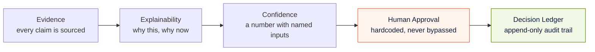
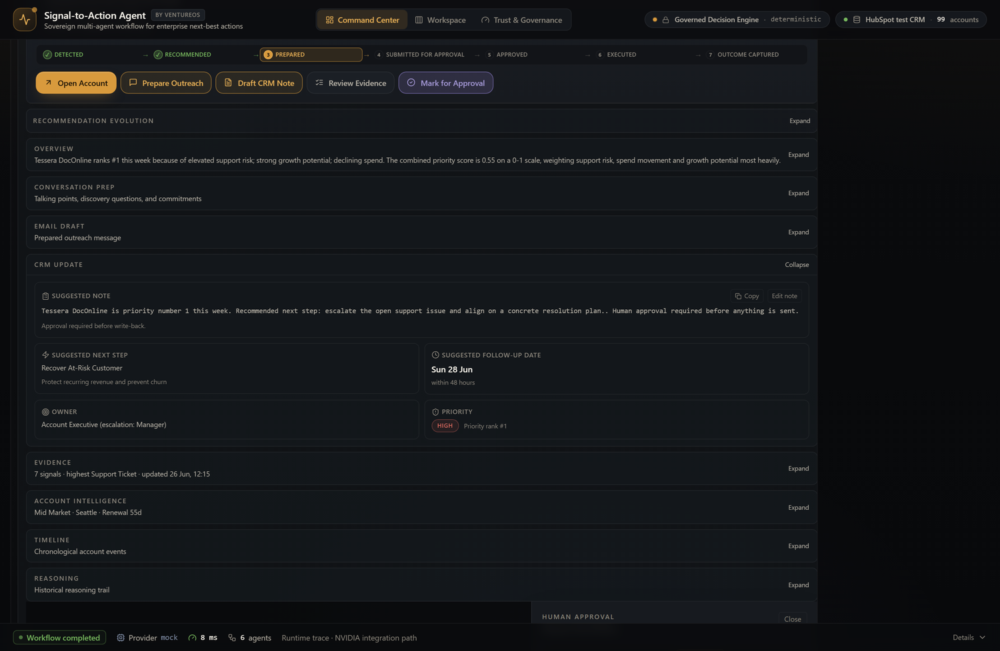
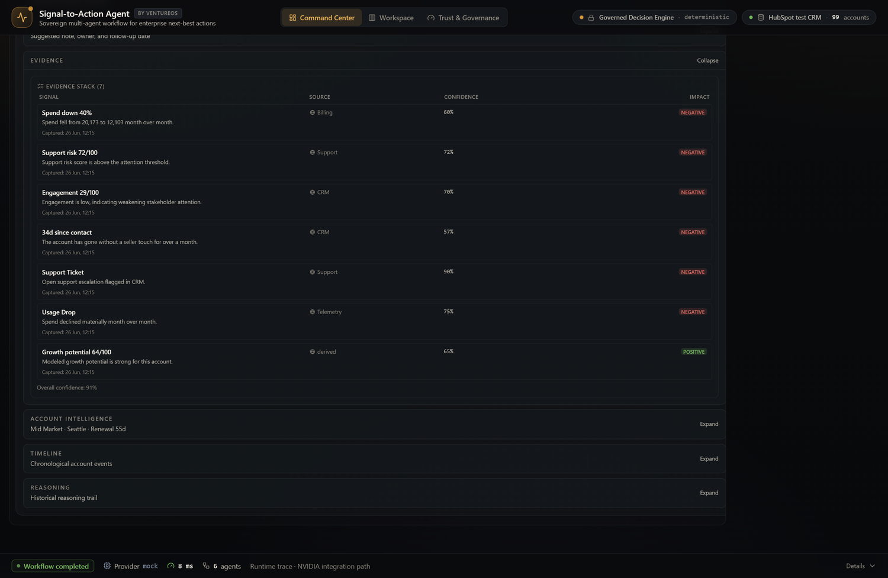
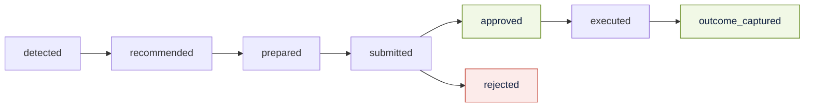

# Governance — Trust, Approval, and the Decision Ledger

> How Signal-to-Action Agent earns enterprise trust: a human approves every
> action, every recommendation is backed by attributable evidence, and every
> decision is written to an auditable ledger. For CIOs, risk owners, and
> enterprise architects.

The governing principle of the product fits on one line:

> **AI assists. Humans decide. Every decision is logged.**

This same boundary applies to the planned Decision Intelligence Studio and Trend
Intelligence surfaces (**Next / In Review**): they are designed to improve explanation
and scenario readability, and will not alter ranking, scoring, approval requirements, or
ledger schema.

Nothing the AI produces is ever auto-executed. The system is engineered so that
governance is not a policy bolted on top — it is an agent in the workflow and a
gate in the data flow.

---

## 1. The five pillars of trust



| Pillar | Guarantee | Where it lives |
|---|---|---|
| **Evidence** | Every recommendation carries a list of evidence, each attributed to a source agent and a source system | `Account Health` + `Opportunity` agents |
| **Explainability** | Risk summary, opportunity summary, "why now," and a per-account narrative | Deterministic reasoning + model phrasing |
| **Confidence** | A 0–1 score from a transparent formula, with caveats when low | `Governance Agent` |
| **Human approval** | `requires_human_approval` is always `True`; status starts `pending` | `Governance Agent` + approval UI |
| **Audit trail** | An append-only Decision Ledger of every decision and outcome | `lib/decisionLedger.ts` + ledger service |

---

## 2. The Governance Agent — governance as code

The fourth agent in the workflow exists for one reason: to make the workflow
*governed*. It is fully deterministic and runs for **every** account.

**The invariant, verbatim from the code** (`agents/governance_agent.py`):

```python
HUMAN_APPROVAL_CAVEAT = "Human approval required before any message is sent or action is executed."
# ...
requires_human_approval=True
```

That field is hardcoded `True`. There is no configuration, no query, and no
confidence level that can set it to `False`. Even a maximally confident,
heavily-evidenced recommendation arrives at the UI with `approval_status:
pending`.

**Confidence is a formula, not a vibe:**

```
confidence = 0.15
           + 0.45 * evidence_factor      (evidence_count / 5, capped at 1)
           + 0.25 * avg_signal_strength
           + 0.15 * signal_factor        (signal_count / 3, capped at 1)
```

**Status ladder:** `insufficient_evidence` → `review_required` (confidence below
the **0.55** action threshold) → `ok`.

**Caveats are added — never hidden — when:**

- there are no first-party signals (metrics-only recommendation),
- fewer than two evidence items exist,
- confidence is below the 0.55 threshold,
- positive and negative signals are mixed,
- and the human-approval caveat, always.

Low confidence does not get silently dropped or rounded away. It becomes a
visible status and a written caveat the seller sees before they act.

---

## 3. The approval gate

When a seller acts on a recommendation, they open the approval drawer and choose
**Approve**, **Reject**, or **Request Review** — with an optional reviewer note.
Nothing leaves the system until they do.



The drawer shows the governance caveats inline, the lifecycle state, and (after
approval) an advisory "ready for CRM write-back" pill — advisory because, in the
demo, the write-back is intentionally **not enabled** (see
[Revenue Execution](REVENUE_EXECUTION.md)).

Evidence is always one click away, so an approver can verify the basis of any
recommendation before deciding:



---

## 4. The Decision Ledger

Every decision is appended to a Decision Ledger — the system's audit spine. It
records the recommendation, the account, the reviewer, the decision, the
confidence, the risk and opportunity context, the evidence count, the governance
caveat, and (later) the captured business outcome.



The ledger lifecycle runs `detected → recommended → prepared → submitted →
approved / rejected → executed → outcome_captured`. Captured outcomes are a fixed
vocabulary: **meeting booked, customer contacted, renewal risk reduced,
opportunity created, no response, follow-up required**. This closes the loop from
signal to measured result and feeds the manager summary (reviewed / approved /
rejected / revenue-at-risk-reviewed / revenue-protected / opportunities-advanced).

In the runtime, the backend also emits a `DecisionLedger` object per
`/api/recommendations` run — one `LedgerAgentStep` per agent (status, summary,
evidence count, duration), the average confidence, the caveats, the final
recommendation, and `approval_status: pending_human_approval`. The on-screen
ledger and the backend ledger share the same model. See
[Agent Architecture §5](AGENT_ARCHITECTURE.md#5-how-the-agents-collaborate).

---

## 5. Why the ledger is local in the demo (and what production looks like)

In the deployed demo, the Decision Ledger persists to the browser
(`localStorage`, key `s2a_decision_ledger_v1`) behind a deliberately
backend-swappable API (`appendLedgerEntry`, `listLedger`, `recordOutcome`,
`summarize`, …). That choice keeps the public demo zero-cost and stateless while
proving the full lifecycle end to end.

The production path — and the hackathon roadmap — moves this persistence to the
backend SQLite ledger service already present in the API, and routes approved
actions through the HubSpot connector (task + note + verify). The contract does
not change; only the storage tier does. See [Roadmap](ROADMAP.md).

---

## 6. Provider abstraction and BYOK — trust at the model layer

Governance extends to *which model* reasons over your data.

- **Provider abstraction.** The language model sits behind a model-adapter
  interface (`model_adapters/`). The default is a deterministic mock; NVIDIA NIM
  (Nemotron) is a first-class adapter target. No provider is hardwired. See
  [NVIDIA Alignment](NVIDIA_ALIGNMENT.md).
- **BYOK (Bring Your Own Key).** When a reviewer supplies an OpenAI, Anthropic,
  or NVIDIA key to compare reasoning, the key is held in **`sessionStorage`
  only** (`lib/byok.ts`), never written to `localStorage`, never committed, never
  logged, and never persisted server-side. It is cleared when the tab closes.
- **Advisory only.** LLM decisions never write to CRM and never bypass the human
  gate. On any missing key, error, timeout, or invalid response, the system falls
  back to the deterministic engine — which remains the source of truth.

---

## 7. Data privacy and repository safety

- All demo data is **synthetic** (`data/generate_synthetic_data.py`, fixed seed)
  or a dedicated **HubSpot test CRM portal** — no real customer data.
- No secrets are committed. Only `.env.example` files are tracked; real keys live
  in a git-ignored `.env`. See [Security](SECURITY.md).
- The external-signals layer is read-only, off by default, and never feeds the
  ranking or scoring engine.

---

## Related documentation

- [Agent Architecture](AGENT_ARCHITECTURE.md) — the Governance Agent in context
- [Revenue Execution](REVENUE_EXECUTION.md) — the approved-to-outcome lifecycle
- [Architecture](ARCHITECTURE.md) — where the gate sits in the data flow
- [Security](SECURITY.md) — secrets, BYOK, responsible disclosure
- [FAQ](FAQ.md) — "why human approval?" and "why a decision ledger?"

> The fastest way to lose an enterprise is to act without permission. This system
> cannot — by construction.
