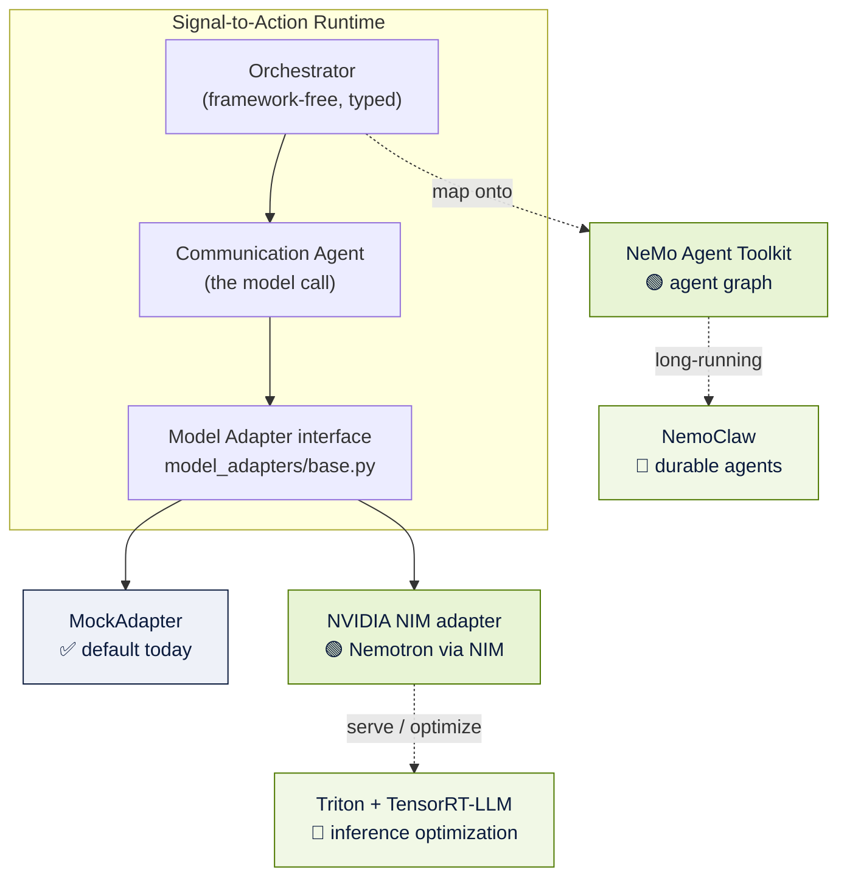

# NVIDIA Alignment — How Signal-to-Action Maps onto the NVIDIA Stack

> Where NVIDIA technology fits, what is implemented today, what we build during
> the NVIDIA Open Hackathon, and what is future vision. Honest labeling
> throughout — no overclaims. For NVIDIA judges and technical reviewers.

Signal-to-Action Agent was architected from day one to be **NVIDIA-ready** rather
than retrofitted. The model layer is provider-abstracted, the agents are
typed and framework-free, and the reasoning workload is exactly the kind of
governed, multi-step inference NVIDIA's agentic stack is built to accelerate.

This document distinguishes three horizons for every technology:

- ✅ **Implemented** — running in the codebase today.
- 🟢 **Hackathon** — to be implemented during the NVIDIA Open Hackathon.
- 🔭 **Future** — vision beyond the hackathon.

For the deeper phased engineering plan, see
[nvidia-integration-plan.md](nvidia-integration-plan.md). This document is the
executive map; that one is the implementation detail.

---

## 1. The integration map

---

## 2. Technology-by-technology alignment

### NVIDIA NIM (NVIDIA Inference Microservices)

| Horizon | Detail |
|---|---|
| ✅ Implemented | A NIM adapter **stub** exists today: `model_adapters/nvidia_nim_adapter.py`, OpenAI-compatible, driven by `NVIDIA_API_KEY`, `NVIDIA_BASE_URL`, and `NVIDIA_MODEL`. The factory routes NVIDIA aliases to it. |
| 🟢 Hackathon | Point the adapter at a live NIM endpoint and run the Communication Agent's drafts (email / call script / voice summary) through Nemotron-served NIM. No agent contract changes. |
| 🔭 Future | Per-tenant NIM deployments; private model hosting for data-sovereign customers. |

### NVIDIA Nemotron

| Horizon | Detail |
|---|---|
| ✅ Implemented | The reasoning seam is ready — the Communication Agent receives a structured payload and returns prose, so a Nemotron model can drop in behind the adapter. |
| 🟢 Hackathon | Use Nemotron (via NIM) as the explanation/drafting model and A/B it against the deterministic baseline using the existing **BYOK comparison mode**. |
| 🔭 Future | Nemotron for richer multi-account synthesis and the voice brief, always advisory to the deterministic ranking. |

### NeMo Agent Toolkit

| Horizon | Detail |
|---|---|
| ✅ Implemented | The orchestrator is intentionally **framework-free** with typed `agent_outputs.py` contracts — purpose-built to be mapped onto an agent toolkit without losing the data shape. |
| 🟢 Hackathon | Map the fixed `AGENT_SEQUENCE` onto a NeMo Agent Toolkit graph; the typed contracts become tool schemas; the human-approval gate becomes a governed tool boundary. |
| 🔭 Future | Parallelize the independent Health and Opportunity agents on the toolkit's runtime as a first GPU-era optimization. |

### NemoClaw (long-running agents)

| Horizon | Detail |
|---|---|
| ✅ Implemented | Not used today — the workflow is request/response and deterministic. |
| 🟢 Hackathon | Prototype a long-running "watch this account" agent that re-evaluates on signal drift, still emitting governed recommendations. |
| 🔭 Future | Durable, always-on portfolio agents that maintain state across days and proactively surface change — the engine behind a true Chief of Staff. |

### Triton Inference Server + TensorRT-LLM

| Horizon | Detail |
|---|---|
| ✅ Implemented | Not used today (mock adapter needs no GPU). |
| 🟢 Hackathon | Benchmark Nemotron inference latency/throughput for the drafting workload. |
| 🔭 Future | Serve optimized models via Triton/TensorRT-LLM for GPU-backed, low-latency batch reasoning across large portfolios. |

### Structured outputs

| Horizon | Detail |
|---|---|
| ✅ Implemented | Every agent already produces a typed Pydantic object; the contracts are strict and validated. |
| 🟢 Hackathon | Enforce model JSON against those schemas using NIM/Nemotron structured-output / guided decoding, with deterministic fallback on any invalid output (already the fallback rule today). |
| 🔭 Future | Schema-guided generation across the whole comms surface for guaranteed-parseable drafts. |

### Evaluation

| Horizon | Detail |
|---|---|
| ✅ Implemented | A deterministic eval harness (`evals/`, 10/10 checks) validates the reasoning engine on every change. |
| 🟢 Hackathon | Extend evals to score LLM-vs-deterministic agreement, divergence, and reasoning quality across providers. |
| 🔭 Future | Continuous evaluation gating for any model promotion (NeMo Evaluator-style). |

### Provider abstraction

| Horizon | Detail |
|---|---|
| ✅ Implemented | `model_adapters/` (mock, NVIDIA NIM stub, OpenAI/Claude placeholders) **and** a BYOK `decision_providers/` layer (deterministic baseline + OpenAI + Anthropic + NVIDIA), session-only keys, deterministic fallback. No provider is hardwired. |
| 🟢 Hackathon | Make NVIDIA the live, preferred reasoning provider in the comparison while keeping the abstraction intact. |
| 🔭 Future | Per-tenant provider selection and routing policies. |

---

## 3. Why this is a genuinely AI-native, GPU-relevant workload

This is not a CRUD app with a chatbot bolted on. The core workload is:

- **Multi-step agentic reasoning** over a portfolio (per-account health,
  opportunity, governance), exactly the shape NeMo Agent Toolkit targets.
- **Structured, schema-constrained generation** for every seller-facing draft —
  a natural fit for NIM/Nemotron guided decoding.
- **Embarrassingly parallel** per-account inference that scales with GPUs as the
  portfolio grows from 99 demo accounts to enterprise-scale books.
- **Latency-sensitive** voice interaction (planned) where Triton/TensorRT-LLM
  optimization directly improves the experience.

The deterministic engine remains the source of truth and benchmark; NVIDIA
acceleration makes the *explanatory* and *conversational* layers richer and
faster without ever touching the governance guarantees.

---

## 4. What we will demonstrate at the hackathon

1. The Communication Agent's drafts generated by **Nemotron via NIM**, swapped in
   behind the existing adapter with zero contract changes.
2. A live **deterministic-vs-NVIDIA comparison** in the BYOK panel.
3. The `AGENT_SEQUENCE` expressed as a **NeMo Agent Toolkit** graph.
4. The first **governed voice loop** (with Gnani.ai) reading a Nemotron-authored
   brief — see [Voice Chief of Staff](VOICE_CHIEF_OF_STAFF.md).

Every one of these preserves the human-approval gate and the Decision Ledger.

---

## 5. Honest status summary

| Claim | Reality |
|---|---|
| "NVIDIA NIM adapter exists" | ✅ True — as a stub wired into the factory, ready for a live endpoint |
| "Runs on Nemotron today" | ❌ No — default is the deterministic mock; Nemotron is the hackathon target |
| "Uses NeMo Agent Toolkit" | ❌ Not yet — the architecture is *designed* to map onto it |
| "Provider-abstracted, no lock-in" | ✅ True — mock / NIM / OpenAI / Anthropic all behind one interface |
| "Voice is built" | ❌ No — voice is a **planned hackathon implementation** |

We would rather under-claim and over-deliver. The architecture is real and
NVIDIA-ready; the NVIDIA-accelerated experience is what the hackathon delivers.

---

## Related documentation

- [nvidia-integration-plan.md](nvidia-integration-plan.md) — the detailed phased engineering plan
- [Agent Architecture](AGENT_ARCHITECTURE.md) — the runtime that maps onto NeMo
- [Architecture](ARCHITECTURE.md) — the model-adapter and provider layers
- [Voice Chief of Staff](VOICE_CHIEF_OF_STAFF.md) — Gnani.ai + Nemotron voice loop
- [Roadmap](ROADMAP.md) — the three horizons in one place

> Provider-abstracted today, NVIDIA-accelerated at the hackathon, GPU-native in
> the future — without ever compromising the human-in-the-loop guarantee.
