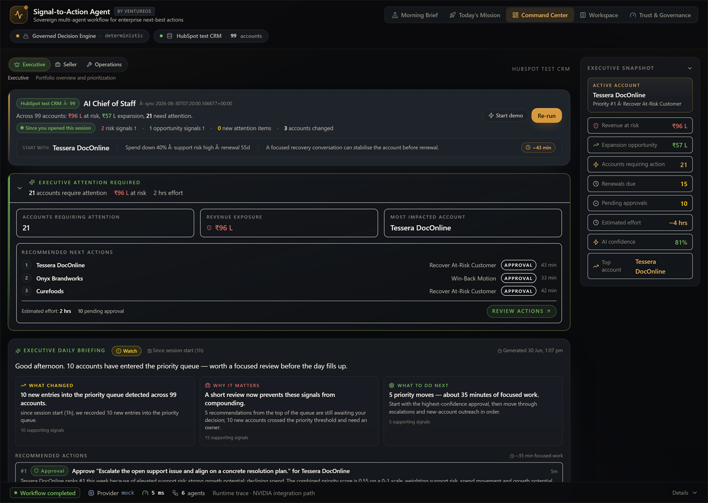

# Product Overview — Signal-to-Action Agent

> A non-technical introduction for PMs, business leaders, hackathon
> judges and anyone evaluating the product without diving into code.

**Live and deployed today:**

| 99 | 108 | 6 | 10 | 10/10 |
|---|---|---|---|---|
| accounts | signals | AI agents | recommendations | evaluation checks |

> Running now on Vercel (web) + Render (API) against a HubSpot test CRM —
> with a Decision Ledger, governed write-back, BYOK provider abstraction, and a
> voice-ready architecture. See [Roadmap](ROADMAP.md) for what is shipped vs.
> planned for the NVIDIA hackathon.

---

## The problem

Sales and customer-success teams manage dozens or hundreds of accounts
and start every week with the same five questions:

1. Which accounts need attention this week?
2. Why do those accounts matter?
3. What is the right next move on each?
4. What evidence justifies that move?
5. Can I trust the recommendation enough to act on it?

Today they answer this by scrolling through CRM, reading dashboards,
opening tabs, and asking their manager. A senior seller might do this
well. A new seller will miss things. Across a team of 30, that is
millions in pipeline left on the table every quarter — not because the
data was missing, but because no one had time to synthesize it.

Generative AI seems to promise an answer. But raw LLMs make leaders
nervous, and rightly so:

- *"What if it makes up an account?"*
- *"What if it writes the wrong note to the wrong customer?"*
- *"How would I even know if the rankings changed week-to-week?"*
- *"Who is accountable when the AI is wrong?"*

---

## The solution

**Signal-to-Action Agent** is a governed AI assistant that combines:

- A **deterministic decision engine** that ranks accounts using
  auditable business rules and cited evidence.
- An **optional LLM reasoning layer** that adds executive summaries,
  conversation strategies, and CRM note drafts on top of the ranking.
- A **human approval gate** that sits between every recommendation and
  every CRM write-back. Nothing reaches the customer record without a
  person clicking *Approve*.

The result is an experience that feels like an AI Chief of Staff — but
behaves like a controlled enterprise product.

---

## Why it matters

| For sellers | For managers | For executives |
|---|---|---|
| The Monday-morning question is answered before they sit down. | A consistent, evidence-backed view of the team's week. | An auditable decision trail. AI is bounded, governance is visible. |
| Less time digging in CRM, more time talking to customers. | Faster, more useful 1:1 coaching. | Confidence that AI is helping but not autonomously acting. |
| A draft CRM note ready for one-click approval. | Visibility into what AI changed and what it didn't. | A credible path to scale across BUs and CRMs. |

---

## What the product can do today

1. **Reads a real CRM** (HubSpot test portal — 99 demo accounts plus
   100 contacts, 100 deals, and 207 recent activities).
2. **Pulls outside-in market signals** (optional, off by default) to add
   colour like funding events, leadership changes or regulatory shifts.
3. **Ranks the entire book** every Monday morning — risk, opportunity,
   confidence — with cited evidence behind every score.
4. **Generates an Executive Morning Brief** at the portfolio level: what
   changed overnight, the single biggest risk, the single biggest
   opportunity, and a sequenced *"what I'd do today"* plan with effort
   estimates.
5. **Generates an Executive Decision Brief per account**: why this
   account matters, internal and external evidence, the recommended
   next-best action, a draft email or call script, a draft CRM note,
   conversation strategy and an explicit *"what not to do"* list.
6. **Lets the user connect their own LLM** (OpenAI, Anthropic Claude or
   NVIDIA Nemotron) from the browser — keys never leave the session.
7. **Compares engines side-by-side** in an executive review-board view
   with an explicit consensus score and named divergences.
8. **Writes back to HubSpot** as tasks and notes — but only after the
   user clicks *Approve*.

### Intelligence layer (Release 1.2 + Next / In Review)

The current build adds an intelligence layer across existing surfaces (no dashboard sprawl).

**Shipped today:**

- **Executive Daily Briefing** — combines what changed, why it changed, and where to act first.
- **Executive Change Brief improvements** — clearer risk increases, opportunity
  moves, and queue movement context.
- **Revenue Execution Center integration** — decision-to-outcome loop connected to
  lifecycle and ledger evidence.

**Next / In Review (not yet confirmed in the deployed build):**

- **Decision Intelligence Studio** — scenario-style decision support with projected
  risk/opportunity impact, assumptions, confidence, reasoning, and expected
  business outcomes before action.
- **Trend Intelligence** — portfolio trend read, account-level trend intelligence,
  and explicit change narratives powered by drift + delta + timeline + ledger.

---

## How trust is handled

This is the part executives ask about first.

**AI helps with**

- Executive summaries
- Conversation strategies
- CRM note drafts
- Market intelligence synthesis
- Risk and opportunity narratives

**AI explicitly does NOT**

- Determine ranking
- Change prioritization
- Bypass governance
- Approve actions
- Write to CRM automatically

The boundary is enforced two ways:

1. **In code.** The LLM never touches the priority score, the ranking,
   the confidence calculation, or the approval status. Those live on
   the deterministic engine on the server, and the LLM cannot mutate
   them.
2. **In the UI.** A persistent *AI Reasoning Status* chip in the header
   tells the user, at all times, whether AI is active and what it is
   doing. A *"How AI is helping"* panel lists the six things AI does and
   the five things it does not — in the same view. Every AI-generated
   block carries a *"Generated with X"* attribution.

---

## Bring Your Own Key (BYOK)

The product runs with zero LLM keys configured. Users who want
AI-enriched narrative connect their own provider from the browser:

- The key lives only in the browser session.
- Closing the tab clears the key.
- The key is never written to a server, a database, a log file or an
  API response.
- The deterministic engine is always available as a fallback if the
  LLM call fails.

This is unusual for enterprise products and deliberately so. It means:

- Demos work without provisioning a corporate key.
- Pilots can run on personal keys without security review.
- Production deployments can later add Azure Key Vault / AWS KMS
  without changing the UX.

---

## What's demo-ready right now

Open https://ventureos-signal-to-action-agent.vercel.app

- The full Command Center loads with HubSpot test data.
- The Executive Morning Brief is generated deterministically.
- Any priority account can be opened to see its Executive Decision Brief.
- The CRM write-back recommendation appears under each approved action.
- Trust & Governance shows the 12-dimension evaluation board.
- BYOK works with any OpenAI / Anthropic key the user pastes in.
- Provider comparison runs live across the Governed Decision Engine and
  whichever BYOK providers are connected.

A scripted 10-minute walkthrough lives in [`docs/DEMO_SCRIPT.md`](DEMO_SCRIPT.md).

---

## What's planned next

The roadmap is honest and organized in three horizons. See
[`ROADMAP.md`](ROADMAP.md) for detail and
[`NVIDIA_ALIGNMENT.md`](NVIDIA_ALIGNMENT.md) for the NVIDIA mapping.

**Now (shipped):** governed six-agent workflow, Decision Ledger, Revenue
Execution Center, Executive Daily Briefing, Executive Change Brief, HubSpot
integration, BYOK provider abstraction, adaptive experience modes, voice-ready
architecture.

**Next / In Review:** Decision Intelligence Studio, Trend Intelligence.

**Next (Release 1.3 planning):**

- **AI Chief of Staff conversation** (text-first conversational layer)
- **Portfolio memory** ("what changed since yesterday/last session")
- **Natural-language timeline** ("why rank moved from #18 to #3")
- **Meeting prep mode** ("brief me before this account meeting")

**Hackathon (NVIDIA Open Hackathon):**

- **NVIDIA reasoning** — Nemotron via NIM behind the existing model adapter; a
  live deterministic-vs-NVIDIA comparison.
- **Voice Chief of Staff** — the planned Gnani.ai speech layer (STT · SALM ·
  TTS · multilingual), a governed voice loop that never bypasses approval. See
  [`VOICE_CHIEF_OF_STAFF.md`](VOICE_CHIEF_OF_STAFF.md).
- **NeMo Agent Toolkit** — map the typed agent sequence onto the toolkit.
- **Backend Decision Ledger** persistence + automatic governed CRM write-back.

**Future (vision):** Salesforce / Dynamics connectors on the same governance
contract; authentication, RBAC, and multi-tenant isolation; a production key
vault as a managed alternative to BYOK; a Digital Executive Assistant.

Every planned item preserves the governance invariants above.

---

## One-line summary

> Signal-to-Action Agent answers *"which customers need attention this
> week and why?"* with a deterministic ranking, an optional LLM
> narrative on top, and a human approval gate on every step that
> reaches the CRM.

## A governed system of action — the Decision Ledger

The product is no longer just a recommendation workspace; it is a governed system of action.
Every decision a seller makes — approve, reject, request review, and the real-world outcome —
is captured in a Decision Ledger. Managers see a roll-up: how many recommendations were
reviewed, how many approved/rejected, how much revenue at risk was reviewed, how many
opportunities advanced. The lifecycle of each recommendation (Detected → Recommended →
Prepared → Submitted → Approved → Executed → Outcome captured) is visible on the
cockpit and in the Approval Drawer. See [`GOVERNANCE.md`](GOVERNANCE.md) and
[`REVENUE_EXECUTION.md`](REVENUE_EXECUTION.md).

CRM write-back readiness is shown but intentionally disabled in the public demo — the
approved-action pipeline connects to the existing HubSpot connector on the hackathon horizon.

---

## The AI Chief of Staff vision

Today the product answers "who needs attention this week, and why?" through a screen and a
deterministic morning brief. The direction is an **enterprise AI Chief of Staff**: a governed
assistant that proactively briefs a revenue leader, reasons over the whole book, and — through
the planned [Voice Chief of Staff](VOICE_CHIEF_OF_STAFF.md) — can be asked and answered out
loud, including in multilingual, code-switched conversation. Voice is **voice-ready today and a
planned hackathon implementation** — never a claim that it already ships.

This is a category shift: from systems of record, to engagement, to intelligence, to **systems
of reasoning** — where AI reasons, humans govern, and every recommendation becomes an
accountable business outcome.

---

## Related documentation

- [Architecture](ARCHITECTURE.md) · [Agent Architecture](AGENT_ARCHITECTURE.md)
- [Governance](GOVERNANCE.md) · [Revenue Execution](REVENUE_EXECUTION.md)
- [Voice Chief of Staff](VOICE_CHIEF_OF_STAFF.md) · [NVIDIA Alignment](NVIDIA_ALIGNMENT.md)
- [Demo Guide](DEMO_GUIDE.md) · [Quick Start](QUICK_START.md) · [Roadmap](ROADMAP.md)
- Back to the [README](../README.md)
