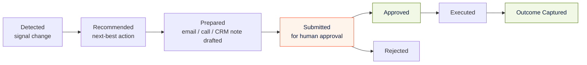
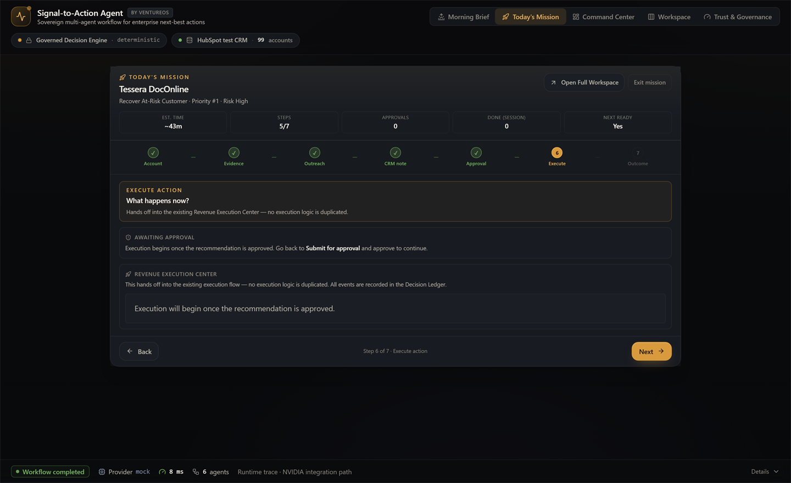
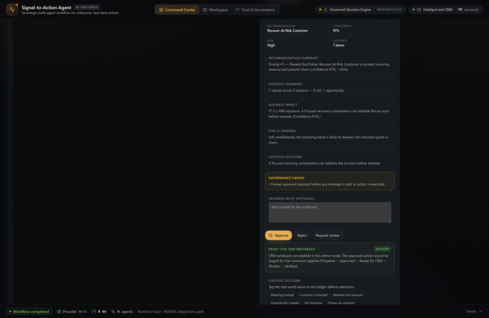
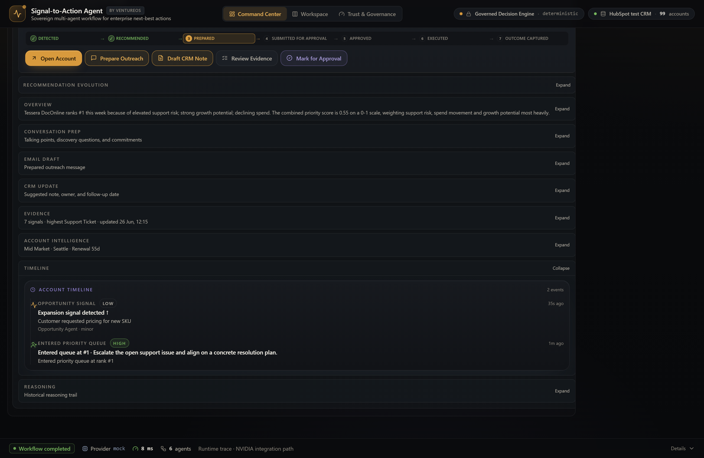
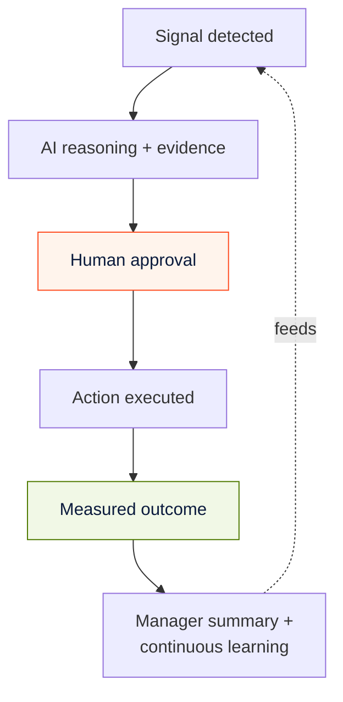

# Revenue Execution — From Approved Decision to Measured Outcome

> The Revenue Execution Center turns an approved recommendation into a tracked,
> accountable business outcome. This is where Signal-to-Action Agent stops being
> an analytics dashboard and becomes a **system of action**. For revenue leaders,
> CIOs, and architects.

Most "AI for sales" tools stop at the recommendation. The hard, valuable part is
everything *after* the recommendation: preparing the action, getting a human to
approve it, executing it, and measuring whether it worked. The Revenue Execution
Center owns that lifecycle.

The Revenue Execution Center is live today. It is designed to pair with Decision
Intelligence (pre-action scenario reading) and Trend Intelligence (change context) —
both **Next / In Review** — so users can understand why an action is recommended
before they approve and execute it.

---

## 1. The execution lifecycle

This is the same lifecycle the [Decision Ledger](GOVERNANCE.md#4-the-decision-ledger)
records, viewed from the seller's execution lens. A recommendation is never
"done" when it is generated — it is done when its outcome is captured.

---

## 2. The five-step execution flow

The seller experiences execution as a guided, five-step pipeline. Each step is
explicit, so nothing is ambiguous and nothing skips the gate.

| Step | What happens | State |
|---|---|---|
| **1 · Prepared** | The Communication Agent has drafted the email, call script, and CRM note. Nothing is sent. | `prepared` |
| **2 · Approved** | A human reviews evidence + caveats and approves, rejects, or requests review. | `approved` / `rejected` |
| **3 · Ready for CRM** | The approved action is queued for write-back. **In the demo this is where the pipeline intentionally stops.** | `ready_for_crm` |
| **4 · Written** | The action is written to CRM (task + note). *(Production / hackathon path.)* | `written` |
| **5 · Verified** | The write-back is confirmed in the system of record. *(Production / hackathon path.)* | `verified` |

The pipeline visibly lights up step by step as decisions move through it, and it
**stops at "Ready for CRM" with an explicit note** that write-back is not enabled
in demo mode. That honesty is deliberate — the system never pretends to have done
something it has not.

---

## 3. Preparation — the seller cockpit

Before approval, the workspace assembles everything a seller needs to act, drafted
by the agents but never sent automatically:

- **Conversation prep** — objective, why now, talk track, discovery questions,
  the commitment to secure.
- **Email draft** — editable, copyable, with an approval state. Not auto-sent.
- **CRM update** — a suggested note, next action, and follow-up date. Not
  auto-written.
- **Evidence** — the full evidence stack with source, confidence, polarity, and
  capture time.

Each draft is the Communication Agent's output (the only agent that calls the
model). Everything is advisory until a human approves.

---

## 4. Outcome capture — closing the loop

After an action is approved and executed, the seller records what actually
happened. Outcomes are a fixed, structured vocabulary so they roll up cleanly:

| Outcome | Meaning |
|---|---|
| **Meeting booked** | The outreach secured a meeting |
| **Customer contacted** | Contact made, no commitment yet |
| **Renewal risk reduced** | A renewal risk was actively de-risked |
| **Opportunity created** | A new expansion opportunity opened |
| **No response** | No reply to the outreach |
| **Follow-up required** | Needs another touch |

Captured outcomes feed the **manager summary**: accounts reviewed, approved,
rejected, review requested, revenue-at-risk reviewed, **revenue protected**, and
**opportunities advanced**. This is how a leader sees, in one place, what the
revenue motion actually produced — not just what was recommended.

---

## 5. Decision progression and business outcomes

Contrast this with a traditional CRM, where the loop is: data → seller guesses →
action → unknown outcome. Signal-to-Action replaces "guess" with evidence-backed
reasoning and "unknown outcome" with a captured, attributable result.

---

## 6. Current implementation vs. roadmap

Clear labeling matters — here is exactly what runs today versus what is planned.

| Capability | Status |
|---|---|
| Execution lifecycle (detected → outcome captured) | **Implemented** |
| Five-step execution pipeline UI | **Implemented** |
| Approval gate before any execution | **Implemented** |
| Outcome capture + manager summary | **Implemented** |
| Decision Ledger integration | **Implemented** (browser persistence in demo) |
| HubSpot write-back of an approved action (task + note) | **Implemented** as an approval-gated connector action; **disabled in the public demo** |
| Ledger persistence moved to backend SQLite | **Hackathon / roadmap** |
| Automatic write-back + verification on approval | **Hackathon / roadmap** |
| Revenue-protected / opportunities-advanced as live KPIs | **Hackathon / roadmap** |

> Note on CRM write-back: the connector *can* create a HubSpot task + note after
> approval (proven against a HubSpot test portal), but the public demo keeps
> write-back **off** so the pipeline stops at "Ready for CRM." This is a
> configuration choice, not a missing capability. See [Architecture](ARCHITECTURE.md)
> and [Roadmap](ROADMAP.md).

---

## 7. Future: CRM write-back and execution orchestration

The roadmap turns "Ready for CRM" into a closed loop:

- **CRM write-back** — approved actions create tasks, notes, and follow-ups in the
  system of record, with a verification step that confirms the write.
- **Execution orchestration** — sequencing multi-step plays (e.g., escalate →
  schedule → recap) with the human gate preserved at each commit point.
- **Outcome-aware learning** — captured outcomes inform future prioritization,
  always advisory, never overriding governance.

Every future step keeps the same invariant: **no autonomous write without human
approval.**

---

## Related documentation

- [Governance](GOVERNANCE.md) — the approval gate and Decision Ledger
- [Agent Architecture](AGENT_ARCHITECTURE.md) — the Action and Communication agents
- [Architecture](ARCHITECTURE.md) — the HubSpot connector and data flow
- [Roadmap](ROADMAP.md) — Current / Hackathon / Future horizons
- [Voice Chief of Staff](VOICE_CHIEF_OF_STAFF.md) — approving execution by voice (planned)

> A recommendation no one acts on is a report. A recommendation a human approves
> and the system measures is revenue.
