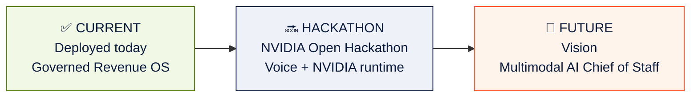

# Roadmap — Signal-to-Action Agent

> Where the product is today, what we will build during the NVIDIA Open
> Hackathon, and the long-term vision. Three horizons, clearly labeled —
> matching the NVIDIA submission deck.

The architecture is designed so each future step slots in **without changing
the deterministic engine, the typed contracts, or the governance posture.**

Every horizon preserves the founding invariant:

> **AI helps explain and recommend. AI does not determine priority, change
> governance, or execute CRM actions. Humans remain accountable for all
> decisions.**

---

## ✅ Horizon 1 — Current (built & deployed)

Live at **https://ventureos-signal-to-action-agent.vercel.app** with a
deployed FastAPI backend on Render. Operating proof: **99 accounts · 108
signals · 6 agents · 10 recommendations per run · 10/10 evaluation checks**.

| Capability | What it does | Status |
|---|---|---|
| **Command Center** | Adaptive executive dashboard — the home surface | ✅ Live |
| **AI Chief of Staff brief** | Portfolio-level narrative: what changed, biggest risk, biggest opportunity, "what I'd do today" | ✅ Live |
| **Portfolio Pulse** | Real-time view of account drift and agent activity | ✅ Live |
| **Executive Attention Brief** | The accounts that need action this week, ranked | ✅ Live |
| **Recommendation Queue** | Prioritized, evidence-backed next-best actions | ✅ Live |
| **Account Workspace** | Per-account cockpit: evidence, drafts, approval, lifecycle | ✅ Live |
| **Evidence** | Every recommendation traced to cited signals, sources, confidence | ✅ Live |
| **Recommendation Evolution** | Timeline of how a recommendation changed as signals moved | ✅ Live |
| **Human Approval** | Mandatory approve / reject / request-review gate | ✅ Live |
| **Governance** | Trust & Governance surface, caveats, confidence, audit | ✅ Live |
| **Decision Ledger** | Persistent, auditable record of every decision + outcome | ✅ Live |
| **Revenue Execution Center** | Governed action lifecycle (Detected → … → Outcome Captured); CRM write-back gated by approval | ✅ Live (write-back gated in demo) |
| **Adaptive Experience Modes** | Executive / Seller / Operations views of the same data | ✅ Live |
| **HubSpot integration** | Sync companies/contacts/deals/activities; approved task + note write-back | ✅ Live |
| **Multi-agent orchestration** | Six typed agents behind a deterministic engine | ✅ Live |
| **Provider abstraction** | Model-adapter pattern; no hardwired vendor | ✅ Live |
| **BYOK** | Bring-your-own OpenAI / Anthropic / NVIDIA key from the browser | ✅ Live |
| **Developer Diagnostics** | Internal-only panel (Ctrl/Cmd+D); endpoint + health, no secrets | ✅ Live |
| **Decision Impact Studio** | Simulate the portfolio impact of a decision | 🟡 In Review |

See [Product Overview](PRODUCT_OVERVIEW.md) and [Architecture](ARCHITECTURE.md)
for the full picture.

---

## 🔜 Horizon 2 — Hackathon (planned during the NVIDIA Open Hackathon)

Two parallel workstreams: a **voice interaction layer** and the **NVIDIA
inference runtime**. Both slot into the existing governed architecture — voice
never bypasses governance, and NVIDIA providers plug into the same typed
contract the deterministic engine already uses.

### Voice Chief of Staff (planned)

The platform evolves from an Enterprise Revenue Operating System → an Enterprise
AI Chief of Staff → a **voice-native** Revenue Operating System. Voice is an
**interaction layer**, not a new model and not a bypass of governance.

| Item | Description |
|---|---|
| **Gnani.ai speech layer** | Planned enterprise speech partner: Speech-to-Text, SALM (Speech-Augmented Language Models), Text-to-Speech |
| **Voice conversations** | Spoken "which accounts need attention?" → spoken brief and next steps |
| **Multilingual + code-switching** | Indian-language support, telephony-grade, low latency |
| **Spoken portfolio reviews** | Hands-free executive briefings over the same governed data |

> **Status: planned hackathon implementation.** The architecture is
> voice-ready today; the voice layer is **not yet built**. See
> [Voice Chief of Staff](VOICE_CHIEF_OF_STAFF.md).

### NVIDIA runtime (planned)

| Item | Description |
|---|---|
| **NVIDIA NIM endpoints** | Nemotron reasoning behind the existing model-adapter (`nvidia_nim_adapter.py` stub today) |
| **NeMo Agent Toolkit** | Map the six-agent orchestrator onto typed agent graphs |
| **Structured outputs** | JSON-schema-constrained generation for every typed contract |
| **Agent evaluation** | Extend the 10-check harness with NVIDIA-backed runs |
| **Triton / GPU optimization** | Batch overnight portfolio planning; latency reduction |

See [NVIDIA Alignment](NVIDIA_ALIGNMENT.md) for the detailed integration plan.

---

## 🔮 Horizon 3 — Future (vision)

| Theme | Items |
|---|---|
| **Multimodal AI Chief of Staff** | Digital Executive Avatar · Live Meeting Coach · Enterprise Multimodal Workspace |
| **More connectors** | Salesforce and Microsoft Dynamics 365 on the same `CRMConnector` contract; Pipedrive / Zoho by demand |
| **Enterprise control plane** | Authentication + SSO · role-based access control · multi-tenant isolation |
| **Production secrets** | Managed key vault (Azure Key Vault / AWS KMS) as an alternative to BYOK |
| **Observability & telemetry** | Tracing, latency, fallback counts, usage metering and billing |
| **Sovereign deployment** | Fully on-premises NVIDIA stack (NIM + NeMo + Triton) for regulated industries |

---

## Connector strategy

| Connector | Horizon | Notes |
|---|---|---|
| **HubSpot** | ✅ Current | Test portal, private-app token, idempotent write-back |
| **Salesforce** | 🔮 Future | Same `CRMConnector` contract; OAuth flow |
| **Microsoft Dynamics 365** | 🔮 Future | Same `CRMConnector` contract; Entra ID app |
| **Pipedrive / Zoho** | 🔮 Future | Driven by demand |

The `CRMConnector` contract is intentionally narrow — `list_accounts`,
`list_contacts`, `list_deals`, `list_activities`, `create_task`,
`create_note`. Adding a connector is a sprint, not a refactor.

## Reasoning provider strategy

| Provider | Horizon |
|---|---|
| **Deterministic Decision Engine** | ✅ Current · source of truth |
| **OpenAI** (GPT-4.1 / 4o family) | ✅ Current · live BYOK (advisory layer) |
| **Anthropic** (Claude family) | ✅ Current · live BYOK (advisory layer) |
| **NVIDIA Nemotron / NIM** | ✅ BYOK wired · 🔜 Hackathon: native NIM runtime |
| **Azure OpenAI** | 🔮 Future · enterprise key-vault path |
| **Local / on-prem models** | 🔮 Future · sovereign deployment |

---

## Related documentation

- [Product Overview](PRODUCT_OVERVIEW.md) — the business story
- [Architecture](ARCHITECTURE.md) — how it all fits together
- [NVIDIA Alignment](NVIDIA_ALIGNMENT.md) — the hackathon integration plan
- [Voice Chief of Staff](VOICE_CHIEF_OF_STAFF.md) — the planned voice layer
- [Revenue Execution](REVENUE_EXECUTION.md) — the governed action lifecycle

> All horizons preserve the governance invariants. AI explains and
> recommends; humans approve; the deterministic engine owns priority.
