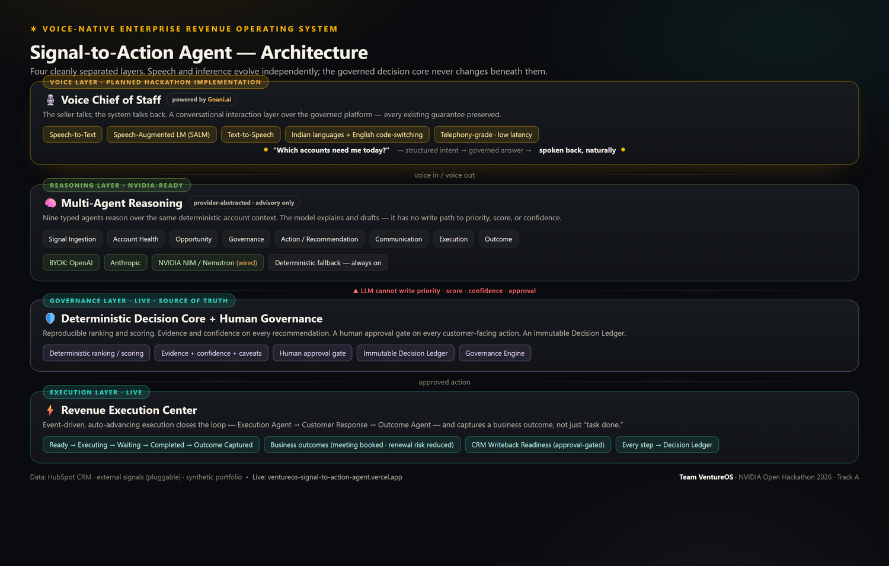
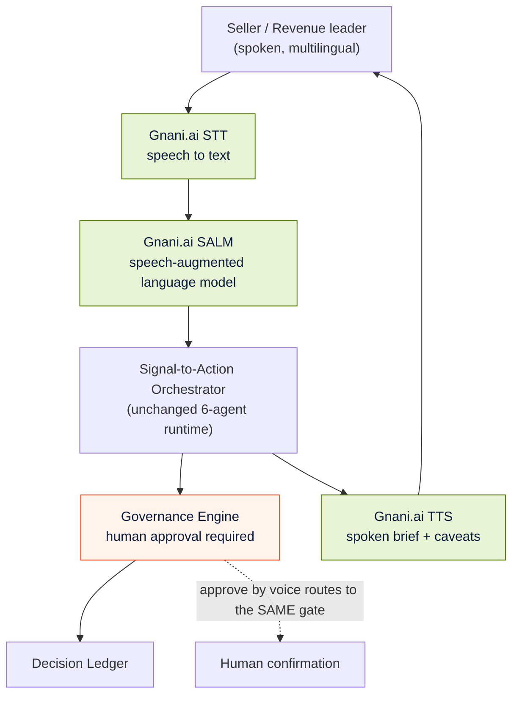

# Voice Chief of Staff — Planned NVIDIA Hackathon Implementation

> ⚠️ **Status: PLANNED — to be implemented during the NVIDIA Open Hackathon.**
> The Voice Chief of Staff is **not yet built.** What exists *today* is a
> **voice-ready architecture**: a governed, typed, multi-agent runtime whose every
> output is already structured for speech. This document describes the planned
> capability and the partner integration. It does not describe a shipped feature.

The platform answers "Which accounts need attention this week, and why?" today
through a screen. The Voice Chief of Staff makes that same governed intelligence
answerable **out loud** — a natural-language, multilingual, telephony-grade
conversational layer on top of the existing workflow.

Voice is an **enhancement**, not a replacement. It does not introduce a second
brain. It speaks the same evidence, the same confidence, and the same
human-approval gate the rest of the product already enforces.

---

## 1. Why voice matters for this product

A field seller or revenue leader is often not at a desk — they are between
meetings, driving, or walking into a customer site. The highest-value moment for
"who needs attention and why" is exactly when a screen is least available.

| Without voice | With the planned Voice Chief of Staff |
|---|---|
| Open laptop, load dashboard, read | "What should I focus on this morning?" — spoken brief |
| Type a query | Ask in natural language, including code-switched Hindi/English |
| Read an evidence list | Hear the top recommendation, its reason, and its caveat |
| Click approve | "Approve the Curefoods escalation" → routed through the **same** human gate |

The destination is a **Digital Executive Assistant**: a hands-free way to run the
governed revenue motion. The hackathon delivers the first governed voice loop;
the avatar/assistant experience is future vision.

---

## 2. Three horizons — kept crystal clear

| Horizon | What it means | Status |
|---|---|---|
| **Voice-ready today** | Every agent output (recommendation, evidence, `voice_summary`, caveat) is already typed and phrasing-ready for speech. The Communication Agent already emits a `voice_summary`. | **Implemented** |
| **Voice Chief of Staff** | Gnani.ai speech layer + a governed voice loop (ask → brief → approve by voice). | **Planned — NVIDIA hackathon** |
| **Digital Executive Assistant** | Persistent, proactive, multilingual assistant / avatar. | **Future vision** |

> The Communication Agent's `voice_summary` field is real and shipping today —
> it is the seam the voice layer will plug into. That is what "voice-ready
> architecture" concretely means.

---

## 3. Planned architecture

The voice layer wraps the existing runtime. It never bypasses it.

**The non-negotiable design rule: voice never bypasses governance.** A spoken
"approve" is still a human approval routed through the same gate, written to the
same Decision Ledger, with the same caveats read aloud. There is no voice path
that auto-executes anything. See [Governance](GOVERNANCE.md).

---

## 4. Gnani.ai — the enterprise speech partner

[Gnani.ai](https://www.gnani.ai/) is the planned **Enterprise Speech Intelligence
Partner** for the voice layer. The integration is scoped to its enterprise speech
stack:

| Capability | Role in the Voice Chief of Staff |
|---|---|
| **Speech-to-Text (STT)** | Transcribe the seller's spoken question, telephony-grade |
| **Speech-Augmented Language Models (SALM)** | Interpret intent directly from speech, robust to accents and noise |
| **Text-to-Speech (TTS)** | Speak the brief, the reason, and the caveats back naturally |
| **Multilingual + code-switching** | Handle Indian-English and mixed Hindi/English in one utterance |
| **Telephony-grade speech** | Work over a phone call, not just a quiet headset |
| **Natural conversational interface** | A back-and-forth assistant, not a command parser |

This pairing is deliberate for an India-first enterprise context: code-switching
and telephony-grade robustness are exactly where generic voice assistants fail
and where Gnani.ai is strong.

---

## 5. The speech pipeline, step by step

1. **Capture** — the seller speaks a question (phone or app).
2. **STT** — Gnani.ai transcribes, handling accent, noise, and code-switching.
3. **SALM intent** — the utterance is mapped to a portfolio query (the same
   `_route_query` strategies the screen uses).
4. **Governed reasoning** — the unchanged six-agent runtime produces ranked,
   evidence-backed recommendations with confidence and caveats.
5. **TTS response** — the top recommendation, its reason, and its caveat are
   spoken back; the `voice_summary` field drives this.
6. **Voice approval** — if the seller says "approve," it routes to the **human
   approval gate** and is logged to the Decision Ledger. Nothing executes
   without it.

---

## 6. Conversation examples (illustrative of the planned experience)

> **Seller:** "Good morning — what needs my attention today?"
> **Voice CoS:** "Seven of your 99 accounts need attention. Top priority is
> Curefoods — spend is down and a renewal is near. Recommended action: recover the
> at-risk customer with an executive renewal call. Confidence is high. Note:
> human approval is required before anything is sent. Want the details?"

> **Seller (code-switched):** "Haan, Razorpay ka kya scene hai?"
> **Voice CoS:** "Razorpay shows an expansion opportunity — strong campaign
> response and rising usage. Recommended action: schedule a cross-sell
> conversation. Shall I prepare the brief for your approval?"

> **Seller:** "Approve the Curefoods escalation."
> **Voice CoS:** "Approval recorded for Curefoods and logged to the decision
> ledger. The action is prepared and marked ready — it will not be sent to CRM
> until write-back is enabled. Anything else?"

---

## 7. Business scenarios

- **Morning brief on the commute** — hear the portfolio brief before the first
  meeting.
- **Hands-free triage between customer visits** — ask, hear, approve, move on.
- **Telephony-first markets** — a manager without a laptop runs the motion over a
  phone call.
- **Accessibility** — a spoken interface broadens who can operate the system.

---

## 8. What stays exactly the same

Voice changes the *interface*, never the *guarantees*:

- The six-agent deterministic workflow is unchanged.
- Priority and confidence still come from code, not from the voice model.
- Human approval is still hardcoded and required.
- Every spoken decision is still written to the Decision Ledger.
- The model layer is still provider-abstracted (and NVIDIA-ready).

---

## Related documentation

- [Architecture](ARCHITECTURE.md) — the runtime the voice layer wraps
- [Governance](GOVERNANCE.md) — why a spoken "approve" is still a governed approval
- [NVIDIA Alignment](NVIDIA_ALIGNMENT.md) — Nemotron / NIM reasoning behind the voice
- [Roadmap](ROADMAP.md) — where voice sits across the three horizons
- [Product Overview](PRODUCT_OVERVIEW.md) — the Chief of Staff vision

> **Reminder:** the Voice Chief of Staff is a planned hackathon implementation.
> Today the product is voice-*ready*; the spoken experience is what we build with
> Gnani.ai during the NVIDIA Open Hackathon.
