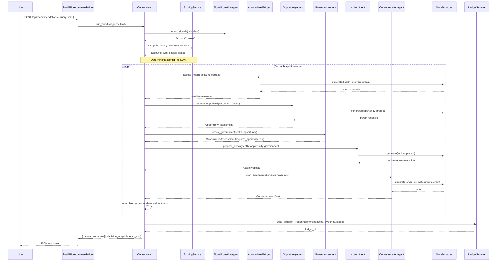

# Architecture: Signal-to-Action Agent

## Overview

Signal-to-Action Agent implements a **governed multi-agent workflow** for turning fragmented customer signals into explainable, human-approved next-best actions. The architecture emphasizes **deterministic scoring, typed agent contracts, evidence provenance, and model-adapter separation** to enable sovereign, auditable, NVIDIA-ready deployments.

---

## Visual Metaphor

```
┌─────────────┐      ┌──────────────┐      ┌──────────────┐      ┌─────────────┐
│  Customer   │──────│   6 Agent    │──────│   Decision   │──────│   Human     │
│  Signals    │      │  Workflow    │      │    Ledger    │      │  Approval   │
│ (fragmented)│      │ (orchestrated│      │ (evidence +  │      │  → Action   │
└─────────────┘      │  reasoning)  │      │  governance) │      └─────────────┘
                     └──────────────┘      └──────────────┘
```

**Pipeline:** Signals → Agents → Decision Ledger → Human-Approved Action

---

## Component Diagram

```
┌─────────────────────────────────────────────────────────────────┐
│                          FRONTEND (Next.js)                      │
│  - App Router (TypeScript + Tailwind CSS)                       │
│  - Dark enterprise console UI (NVIDIA green accent #76B900)     │
│  - Pages: /dashboard, /accounts, /recommendations               │
│  - Calls backend HTTP API (fetch to localhost:8000)             │
└────────────────────────┬────────────────────────────────────────┘
                         │ HTTP (JSON)
                         ▼
┌─────────────────────────────────────────────────────────────────┐
│                      BACKEND (FastAPI + Python)                  │
│  ┌──────────────────────────────────────────────────────────┐   │
│  │  API Layer (services/api/main.py)                        │   │
│  │  GET  /api/health                                        │   │
│  │  GET  /api/accounts                                      │   │
│  │  GET  /api/accounts/{account_id}                         │   │
│  │  POST /api/recommendations  ← Core orchestration         │   │
│  │  POST /api/actions/{recommendation_id}/approve           │   │
│  │  POST /api/actions/{recommendation_id}/reject            │   │
│  └──────────────────┬───────────────────────────────────────┘   │
│                     │                                            │
│  ┌──────────────────▼───────────────────────────────────────┐   │
│  │  Agent Orchestrator (agents/orchestrator.py)             │   │
│  │  - Runs 6 agents in sequence with typed contracts        │   │
│  │  - Returns ranked recommendations + decision ledger      │   │
│  └──────────────────┬───────────────────────────────────────┘   │
│                     │                                            │
│      ┌──────────────┼──────────────┬──────────────┐             │
│      ▼              ▼              ▼              ▼             │
│  ┌────────┐  ┌──────────┐  ┌───────────┐  ┌──────────┐         │
│  │ Signal │  │ Account  │  │Opportunity│  │Governance│         │
│  │Ingestion│ │ Health   │  │  Agent    │  │  Agent   │         │
│  │ Agent  │  │  Agent   │  └───────────┘  └──────────┘         │
│  └────────┘  └──────────┘         │              │             │
│      │              │              ▼              ▼             │
│      │              │        ┌──────────┐  ┌──────────┐         │
│      │              │        │ Action   │  │Communi-  │         │
│      │              │        │  Agent   │  │cation    │         │
│      │              │        └──────────┘  │ Agent    │         │
│      │              │                      └──────────┘         │
│      └──────────────┴──────────────┬────────────┘               │
│                                    │                            │
│  ┌─────────────────────────────────▼────────────────────────┐   │
│  │  Model Adapter Layer (model_adapters/)                   │   │
│  │  ┌────────────┐  ┌───────────┐  ┌────────────────────┐  │   │
│  │  │ base.py    │  │ mock_     │  │ nvidia_nim_        │  │   │
│  │  │ (interface)│  │ adapter   │  │ adapter (stub)     │  │   │
│  │  └────────────┘  │ (active)  │  └────────────────────┘  │   │
│  │                  └───────────┘                          │   │
│  │  Factory: get_model_adapter(MODEL_PROVIDER)             │   │
│  └──────────────────────────────────────────────────────────┘   │
│                                                                 │
│  ┌──────────────────────────────────────────────────────────┐   │
│  │  Services Layer                                          │   │
│  │  - scoring_service.py: deterministic priority scoring    │   │
│  │  - ledger_service.py: SQLite decision ledger + approvals │   │
│  │  - account_service.py: synthetic data loading            │   │
│  └──────────────────────────────────────────────────────────┘   │
│                                                                 │
│  ┌──────────────────────────────────────────────────────────┐   │
│  │  Data Layer (data/)                                      │   │
│  │  - accounts.csv, signals.csv, notes.csv (synthetic)      │   │
│  │  - generate_synthetic_data.py                            │   │
│  └──────────────────────────────────────────────────────────┘   │
│                                                                 │
│  ┌──────────────────────────────────────────────────────────┐   │
│  │  Persistence (SQLite)                                    │   │
│  │  - decisions.db: ledger, recommendations, approvals      │   │
│  └──────────────────────────────────────────────────────────┘   │
└─────────────────────────────────────────────────────────────────┘
```

---

## Agent Workflow (Six-Agent Orchestration)

Each agent has a **typed input/output contract** (Pydantic v2 models) and performs a single responsibility. Agents run **sequentially** in the orchestrator; no agent calls another agent directly.

### 1. Signal Ingestion Agent
**Input:** Raw account + signal data (CSV/JSON)  
**Output:** `AccountContext` (account ID, signals grouped by type, metadata)  
**Role:** Normalize signals, group by account, filter noise

### 2. Account Health Agent
**Input:** `AccountContext`  
**Output:** `HealthAssessment` (risk_score, risk_factors[], summary)  
**Role:** Identify declining spend, low engagement, support issues, inactivity, renewal risk

### 3. Opportunity Agent
**Input:** `AccountContext`  
**Output:** `OpportunityAssessment` (opportunity_score, growth_signals[], summary)  
**Role:** Find positive campaign responses, usage growth, spend movement, high-fit segments

### 4. Governance Agent
**Input:** `HealthAssessment`, `OpportunityAssessment`, evidence quality  
**Output:** `GovernanceAssessment` (confidence_score, caveats[], requires_human_approval=True, governance_status)  
**Role:** Validate evidence sufficiency, add caveats if confidence is low, enforce approval gate

### 5. Action Agent
**Input:** `HealthAssessment`, `OpportunityAssessment`, `GovernanceAssessment`  
**Output:** `ActionProposal` (action_type, action_description, priority, rationale)  
**Role:** Propose next-best action (schedule follow-up, send reactivation message, offer optimization review, escalate support, prepare renewal conversation)

### 6. Communication Agent
**Input:** `ActionProposal`, account context  
**Output:** `CommunicationDraft` (draft_email, call_script, voice_summary)  
**Role:** Generate concise, seller-ready communications in business-friendly language

---

## Orchestrator Workflow (Sequence Diagram)



---

## Deterministic Scoring vs Model-Adapter Reasoning

### Phase 1: Deterministic Scoring (Pre-LLM)

**`services/scoring_service.py`** computes a priority score for each account using weighted sub-scores:

```
priority_score = 
    support_risk_score       * 0.20 +
    spend_decline_score      * 0.20 +
    growth_potential_score   * 0.20 +
    renewal_urgency_score    * 0.15 +
    campaign_response_score  * 0.10 +
    engagement_gap_score     * 0.10 +
    last_contact_gap_score   * 0.05
```

All sub-scores are normalized 0–1. This step is **model-agnostic** and produces a ranked list before any LLM call.

### Phase 2: Model-Adapter Explanation (Post-Ranking)

The model adapter is invoked **only for the top N accounts** (default: 5–10) to:
- Explain risk and opportunity in natural language
- Draft seller-ready emails and call scripts
- Provide reasoning summaries for the decision ledger

This separation ensures:
- **Latency control:** LLM calls are bounded by top-N limit
- **Determinism:** Scoring is reproducible and auditable
- **Cost efficiency:** No API calls for low-priority accounts
- **Governance:** Scores are computed before reasoning, preventing prompt injection from affecting prioritization

---

## Model Adapter Pattern

### Interface: `model_adapters/base.py`

```python
class ModelAdapter(ABC):
    @abstractmethod
    def generate(self, request: GenerationRequest) -> ModelResponse:
        """Generate text from a prompt with optional schema constraints."""
        pass
    
    @abstractmethod
    def health(self) -> bool:
        """Check adapter health."""
        pass
```

### Implementations

| Adapter | File | Status | Use Case |
|---------|------|--------|----------|
| **Mock Adapter** | `model_adapters/mock_adapter.py` | ✅ Active (MVP) | Deterministic demo outputs; no API dependency |
| **NVIDIA NIM Adapter** | `model_adapters/nvidia_nim_adapter.py` | 🚧 Stub | Nemotron reasoning + comms drafting via NIM endpoints |
| **OpenAI Adapter** | *(future)* | ❌ Not included | Optional fallback; not default |

### Factory: `get_model_adapter()`

Reads `MODEL_PROVIDER` environment variable (default: `"mock"`):

```python
def get_model_adapter() -> ModelAdapter:
    provider = os.getenv("MODEL_PROVIDER", "mock")
    if provider == "mock":
        return MockAdapter()
    elif provider == "nvidia-nim":
        return NvidiaNimAdapter(api_key=os.getenv("NVIDIA_API_KEY"))
    else:
        raise ValueError(f"Unknown MODEL_PROVIDER: {provider}")
```

**Key principle:** No hardcoded OpenAI/Anthropic dependencies. The system is designed for **sovereign, on-prem, NVIDIA-accelerated deployments**.

---

## Persistence: SQLite Decision Ledger

**`services/api/decisions.db`** (SQLite) stores:

- **`decisions`**: ledger_id, timestamp, user_query, agents_invoked, evidence_used, reasoning_summary, confidence_score, caveats, final_recommendation, approval_status, model_provider, latency_ms
- **`recommendations`**: recommendation_id, account_id, priority_score, action_type, draft_email, call_script, approval_status (pending/approved/rejected)
- **`approvals`**: recommendation_id, approved_by, approved_at, rejection_reason (optional)

Every workflow invocation writes a ledger entry with:
- Agent execution steps
- Evidence trails (source agent, signal strength, polarity)
- Governance caveats
- Approval status

This enables:
- **Auditability:** "Why did we recommend action X for account Y?"
- **Traceability:** "Which agents and signals contributed?"
- **Compliance:** "Was human approval obtained?"

---

## Request Lifecycle: POST /api/recommendations

1. **User submits query** (e.g., "Which SMB accounts need attention this week?")
2. **API endpoint** (`main.py`) validates request schema
3. **Orchestrator** loads synthetic account + signal data
4. **Signal Ingestion Agent** groups signals by account
5. **Scoring Service** computes deterministic priority scores for all accounts
6. **Orchestrator** sorts accounts by score, selects top N (e.g., 5)
7. **For each top-N account:**
   - Account Health Agent analyzes risk (calls model adapter for explanation)
   - Opportunity Agent analyzes growth (calls model adapter for rationale)
   - Governance Agent validates evidence and sets `requires_approval=True`
   - Action Agent proposes next-best action (calls model adapter)
   - Communication Agent drafts email/script (calls model adapter)
8. **Orchestrator** assembles recommendations with evidence, confidence, caveats
9. **Ledger Service** writes decision ledger to SQLite
10. **API** returns JSON response with recommendations, ledger metadata, latency

**Latency budget (MVP):** <2 seconds on mock adapter; <5 seconds on NVIDIA NIM (Phase 1)

---

## Repository Layout

```
signal-to-action-agent/
├── README.md
├── .env.example                   # MODEL_PROVIDER, NVIDIA_API_KEY
├── docker-compose.yml             # (future: containerized deployment)
├── docs/
│   ├── product-brief.md
│   ├── architecture.md            # ← This file
│   ├── dataset-schema.md
│   ├── nvidia-integration-plan.md
│   ├── evaluation-plan.md
│   └── demo-script.md
├── apps/
│   └── web/                       # Next.js frontend
│       ├── app/                   # App Router pages
│       ├── components/            # React components
│       ├── public/
│       ├── package.json
│       └── tailwind.config.js
└── services/
    └── api/                       # FastAPI backend
        ├── main.py                # API routes
        ├── requirements.txt
        ├── agents/
        │   ├── orchestrator.py    # Six-agent workflow coordinator
        │   ├── signal_ingestion_agent.py
        │   ├── account_health_agent.py
        │   ├── opportunity_agent.py
        │   ├── governance_agent.py
        │   ├── action_agent.py
        │   └── communication_agent.py
        ├── schemas/
        │   ├── account.py         # Pydantic models
        │   ├── recommendation.py
        │   └── ledger.py
        ├── model_adapters/
        │   ├── base.py            # ModelAdapter interface
        │   ├── mock_adapter.py    # Active in MVP
        │   └── nvidia_nim_adapter.py  # Stub for Phase 1
        ├── services/
        │   ├── scoring_service.py # Deterministic scoring
        │   ├── ledger_service.py  # SQLite persistence
        │   └── account_service.py # Data loading
        ├── data/
        │   ├── generate_synthetic_data.py
        │   ├── accounts.csv       # 50 synthetic accounts
        │   ├── signals.csv        # 200+ synthetic signals
        │   └── notes.csv
        ├── evals/
        │   ├── test_queries.json  # 10 evaluation queries
        │   └── evaluation_runner.py
        └── decisions.db           # SQLite ledger
```

---

## Run Commands

### Backend
```bash
cd services/api
python -m venv venv
source venv/bin/activate  # or venv\Scripts\activate on Windows
pip install -r requirements.txt
python data/generate_synthetic_data.py
uvicorn main:app --reload --port 8000
```

### Frontend
```bash
cd apps/web
npm install
# Set env: NEXT_PUBLIC_API_BASE_URL=http://localhost:8000
npm run dev  # Runs on port 3000
```

### Evaluation
```bash
cd services/api
python evals/evaluation_runner.py
```

---

## Design Principles

1. **Model-agnostic:** Adapter pattern enables mock → NVIDIA NIM → NeMo Agent Toolkit migration without refactoring agents
2. **Deterministic-first:** Scoring precedes LLM reasoning; reproducible prioritization
3. **Typed contracts:** Pydantic schemas enforce structure between agents
4. **Evidence provenance:** Every recommendation includes source agent, signal strength, and polarity
5. **Governance by default:** All actions require human approval; caveats surface low-confidence cases
6. **Decision ledger:** Tamper-evident audit trail for compliance and debugging
7. **Latency budget:** Bounded LLM calls (top-N only); async-ready for production

---

**Next:** See [NVIDIA Integration Plan](./nvidia-integration-plan.md) for phased NIM/NeMo adoption and [Evaluation Plan](./evaluation-plan.md) for test harness.
